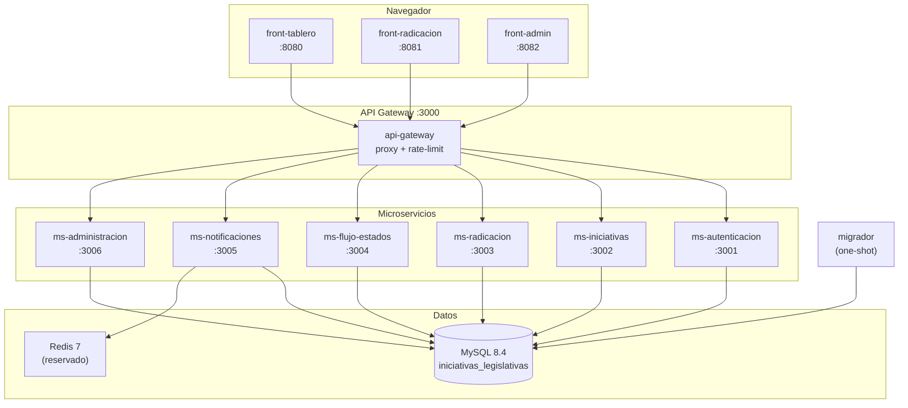
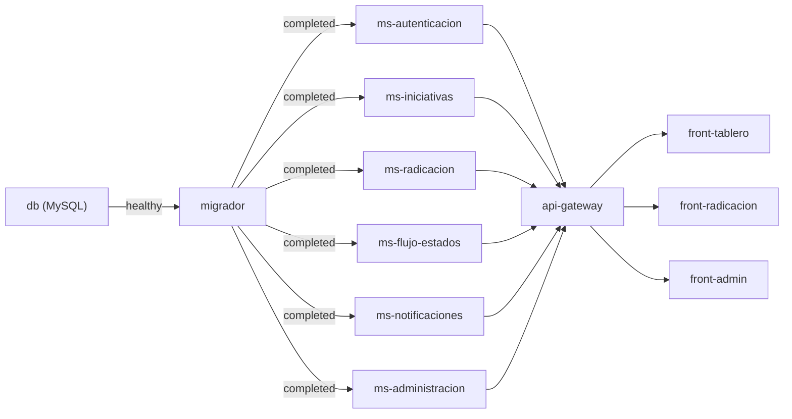

# Arquitectura Técnica — Sistema de Iniciativas Legislativas

**Viceministerio para el Diálogo Social y los Derechos Humanos**
Ministerio del Interior · República de Colombia

**Versión:** 1.0 · **Fecha:** 28 de agosto de 2026

---

## Índice

1. [Visión general](#1-visión-general)
2. [Diagrama de arquitectura](#2-diagrama-de-arquitectura)
3. [Repositorios y estructura](#3-repositorios-y-estructura)
4. [Capa de datos](#4-capa-de-datos)
5. [Capa de servicios (backend)](#5-capa-de-servicios-backend)
6. [API Gateway](#6-api-gateway)
7. [Capa de presentación (frontend)](#7-capa-de-presentación-frontend)
8. [Seguridad y autorización](#8-seguridad-y-autorización)
9. [Infraestructura y despliegue](#9-infraestructura-y-despliegue)
10. [Entornos](#10-entornos)
11. [Pruebas](#11-pruebas)
12. [Decisiones arquitectónicas](#12-decisiones-arquitectónicas)
13. [Pendientes y hoja de ruta](#13-pendientes-y-hoja-de-ruta)

---

## 1. Visión general

El sistema está construido como una **arquitectura de microservicios**
orquestada con Docker Compose. Cada dominio funcional tiene su propio
servicio desplegable de forma independiente, y los tres frontends se
comunican con el backend exclusivamente a través de un API Gateway.

### Principios rectores

| Principio | Implementación |
|---|---|
| Despliegue independiente | Cada microservicio y frontend es un contenedor Docker separado; redesplegar uno no afecta a los demás |
| Seguridad por construcción | Toda la lógica de datos vive en procedimientos almacenados MySQL; la API nunca construye SQL |
| Permisos granulares | La autorización se resuelve por permisos (no roles), verificados ruta por ruta contra la base en cada petición |
| Identidad institucional | Los frontends replican la imagen GOV.CO, cumplen WCAG 2.1 AA (Resolución 1519 MinTIC) |
| Migraciones idempotentes | Las 18 migraciones se aplican en orden sin destruir datos; nunca se edita una ya aplicada |

### Stack tecnológico

| Capa | Tecnología |
|---|---|
| Frontend | React 18 · TypeScript · Vite · React Router · TanStack Query · Recharts · Lucide · CSS vanilla |
| Backend | Node.js 20 · Express 4 · mysql2 · express-session · express-mysql-session |
| Gateway | Express · http-proxy-middleware · express-rate-limit |
| Base de datos | MySQL 8.4 (utf8mb4) |
| Caché / Colas | Redis 7 (reservado; sin uso activo) |
| Infraestructura | Docker · Docker Compose · Nginx (frontends) |
| Control de versiones | Git · GitHub · Submodules |

---

## 2. Diagrama de arquitectura



### Flujo de una petición

```
Navegador → Nginx (front-tablero :8080)
         → JS hace fetch('/api/…')
         → API Gateway (:3000)
         → Proxy inverso → ms-xxx (:300X)
         → pool.query('CALL sp_xxx(?, ?)', [...])
         → MySQL → respuesta JSON → Navegador
```

---

## 3. Repositorios y estructura

El proyecto usa un **repositorio agregador** con 13 submódulos Git:

| Submódulo | Tipo | Puerto | Repositorio |
|---|---|---|---|
| `front-tablero` | Frontend | 8080 | hernan-Saroa/front-tablero |
| `front-radicacion` | Frontend | 8081 | hernan-Saroa/front-radicacion |
| `front-admin` | Frontend | 8082 | hernan-Saroa/front-admin |
| `api-gateway` | Gateway | 3000 | hernan-Saroa/api-gateway |
| `ms-autenticacion` | Microservicio | 3001 | hernan-Saroa/ms-autenticacion |
| `ms-iniciativas` | Microservicio | 3002 | hernan-Saroa/ms-iniciativas |
| `ms-radicacion` | Microservicio | 3003 | hernan-Saroa/ms-radicacion |
| `ms-flujo-estados` | Microservicio | 3004 | hernan-Saroa/ms-flujo-estados |
| `ms-notificaciones` | Microservicio | 3005 | hernan-Saroa/ms-notificaciones |
| `ms-administracion` | Microservicio | 3006 | hernan-Saroa/ms-administracion |
| `db-iniciativas` | Base de datos | — | hernan-Saroa/db-iniciativas |
| `infra-iniciativas` | Infraestructura | — | hernan-Saroa/infra-iniciativas |
| `tipos-compartidos` | Tipos TS | — | hernan-Saroa/tipos-compartidos |

### Estructura del repositorio agregador

```
Iniciativas/                 ← Raíz del repo agregador
├── docker-compose.yml       ← Include → infra-iniciativas/
├── docker-compose.dev.yml   ← Solo levanta MySQL + migrador
├── .env.example             ← Variables de entorno
├── start_all.ps1            ← Script Windows: levanta todo
├── stop_all.ps1             ← Script Windows: detiene todo
├── AGENTS.md                ← Reglas del proyecto (para IA y humanos)
├── INSTALACION.md           ← Guía de instalación
├── README.md                ← Introducción
│
├── db-iniciativas/          ← Fuente única de verdad del esquema
│   ├── migraciones/         ← 18 archivos SQL numerados
│   ├── seeds/               ← Datos de demostración
│   └── scripts/             ← Utilidades de base
│
├── infra-iniciativas/       ← docker-compose.yml de producción
│
├── api-gateway/             ← Proxy inverso + rate-limit
├── ms-autenticacion/        ← Login, registro, sesiones
├── ms-iniciativas/          ← CRUD de iniciativas
├── ms-radicacion/           ← Formulario de radicación
├── ms-flujo-estados/        ← Estados, transiciones, responsables
├── ms-notificaciones/       ← Envío de correo (nodemailer)
├── ms-administracion/       ← Roles, usuarios, configuración
│
├── front-tablero/           ← Tablero + panel de detalle
├── front-radicacion/        ← Formulario público de radicación
├── front-admin/             ← Zona administrativa
│
├── tipos-compartidos/       ← Interfaces TypeScript compartidas
├── docs/                    ← Documentación técnica
├── referencia/              ← Frontend original (sin React)
└── scripts/                 ← Migraciones, verificaciones, contraste
```

---

## 4. Capa de datos

### 4.1. Base de datos

- **Motor:** MySQL 8.4
- **Base:** `iniciativas_legislativas`
- **Charset:** `utf8mb4` / `utf8mb4_unicode_ci`
- **Modelo:** una sola base compartida por los 6 microservicios

> **Decisión de diseño:** las migraciones hacen `ALTER` cruzados entre
> dominios (auth modifica `usuarios`, flujo modifica `iniciativas`), y la
> sesión (`express-mysql-session`, tabla `sesiones`) debe ser la misma para
> todos. Separar en 6 bases sería un rediseño completo.

### 4.2. Tablas principales

| Tabla | Dominio | Propósito |
|---|---|---|
| `direcciones` | Catálogo | Dependencias del Viceministerio |
| `estados` | Flujo | Estados del ciclo de vida |
| `estado_responsables` | Flujo | Quién atiende cada estado |
| `estado_transiciones` | Flujo | Reglas de avance/devolución/rechazo |
| `estado_visibilidad` | Flujo | Quién puede ver en cada estado |
| `iniciativas` | Core | Registro de cada iniciativa |
| `historial_iniciativas` | Core | Línea de tiempo de movimientos |
| `documentos` | Core | Archivos adjuntos |
| `usuarios` | Auth | Cuentas de usuario |
| `roles` | Auth | Definiciones de roles |
| `permisos` | Auth | Catálogo de permisos del sistema |
| `rol_permisos` | Auth | Asignación permiso → rol |
| `sesiones` | Auth | Sesiones activas (express-mysql-session) |
| `configuracion` | Admin | Parámetros del sistema |
| `schema_version` | Sistema | Control de migraciones aplicadas |

### 4.3. Procedimientos almacenados

Toda la lógica de datos reside en **procedimientos almacenados**. La API
**nunca** construye SQL dinámico; siempre hace:

```javascript
pool.query('CALL sp_nombre(?, ?, ?)', [param1, param2, param3])
```

| Procedimiento | Dominio | Acción |
|---|---|---|
| `sp_crear_iniciativa` | Core | Alta con estado inicial del flujo |
| `sp_mover_iniciativa` | Flujo | Transición con validación + historial |
| `sp_actualizar_iniciativa` | Core | Edición con historial |
| `sp_eliminar_iniciativa` | Core | Borrado lógico |
| `sp_crear_usuario` | Auth | Alta con hash de contraseña |
| `sp_actualizar_usuario` | Auth | Edición con guardas previas |
| `sp_asignar_rol` | Auth | Cambio de rol con cierre de sesiones |
| `sp_crear_rol` | Admin | Alta de rol con permisos |
| `sp_actualizar_rol` | Admin | Edición + sincronización de permisos |
| `fn_tiene_permiso(uid, clave)` | Auth | Función: ¿el usuario tiene el permiso? |

### 4.4. Migraciones

18 archivos SQL numerados, idempotentes y ejecutados en orden:

| # | Archivo | Qué hace |
|---|---|---|
| 01 | `01_schema.sql` | Tablas base: direcciones, estados, iniciativas, documentos |
| 02 | `02_procedimientos.sql` | Procedimientos CRUD iniciales |
| 03 | `03_datos_iniciales.sql` | Datos semilla: estados, direcciones, permisos |
| 04 | `04_autenticacion.sql` | Tabla usuarios, sesiones, login, registro |
| 05 | `05_propuestas.sql` | Iniciativa ciudadana (proponente) |
| 06 | `06_roles_permisos.sql` | Sistema de roles y permisos granulares |
| 07 | `07_flujo_estados.sql` | Máquina de estados con transiciones y responsables |
| 08 | `08_correcciones.sql` | Corrección de borrado indebido al guardar |
| 09 | `09_flujo_al_crear.sql` | Estado automático al crear iniciativa |
| 10 | `10_historial_de_edicion.sql` | Historial de ediciones de campos |
| 11 | `11_historial_fiel.sql` | Historial corregido (fiel al cambio real) |
| 12 | `12_ver_proponente.sql` | Permiso `iniciativas.ver_proponente` |
| 13 | `13_tiempo_en_estado.sql` | Cálculo de tiempo en cada estado |
| 14 | `14_autorizacion_y_flujo.sql` | Autorización por permisos y flujo vivo |
| 15 | `15_cuentas_y_sesiones.sql` | Cuentas nuevas con rol dinámico y cierre de sesiones |
| 16 | `16_alta_usuario.sql` | Alta de usuario desde admin |
| 17 | `17_direcciones_admin.sql` | CRUD de direcciones desde admin |
| 18 | `18_flujo_mover_admin.sql` | Superadmin puede mover sin ser responsable |

> **Regla:** una migración aplicada en producción **nunca se modifica**. Se
> escribe la siguiente. Cada una declara `SET NAMES utf8mb4` y registra su
> versión en `schema_version`.

---

## 5. Capa de servicios (backend)

### 5.1. Patrón común

Todos los microservicios siguen el mismo patrón:

```
ms-xxx/
├── src/
│   ├── server.js         ← Express + sesión + CORS + rutas
│   ├── rutas/            ← Definición de endpoints
│   └── middleware/        ← Guardas de sesión y permisos
├── migraciones/          ← Copia local de las migraciones de su dominio
├── docker/
│   └── Dockerfile        ← node:20-alpine, USER node
└── package.json
```

**Dependencias compartidas por los 6:**

| Paquete | Versión | Función |
|---|---|---|
| `express` | 4.x | Framework HTTP |
| `cors` | 2.x | Control de origen cruzado |
| `mysql2` | 3.x | Driver MySQL con promesas |
| `dotenv` | 16.x | Variables de entorno |
| `express-session` | 1.x | Gestión de sesiones |
| `express-mysql-session` | 3.x | Almacén de sesiones en MySQL |

**Adicional por servicio:**

| Servicio | Paquete extra | Función |
|---|---|---|
| ms-autenticacion | `express-rate-limit` | Protección contra fuerza bruta |
| ms-notificaciones | `nodemailer` | Envío de correo electrónico |

### 5.2. Microservicios

#### ms-autenticacion (:3001)

| Responsabilidad | Endpoints |
|---|---|
| Login / logout | `POST /api/auth/login`, `POST /api/auth/logout` |
| Registro (autoservicio) | `POST /api/auth/registro` |
| Sesión actual | `GET /api/auth/sesion` |
| Recuperación de contraseña | `POST /api/auth/recuperar`, `POST /api/auth/restablecer` |
| Cambio de contraseña | `POST /api/auth/cambiar-contrasena` |

#### ms-iniciativas (:3002)

| Responsabilidad | Endpoints |
|---|---|
| CRUD de iniciativas | `GET/POST/PUT/DELETE /api/iniciativas` |
| Detalle de una iniciativa | `GET /api/iniciativas/:id` |
| Historial | `GET /api/iniciativas/:id/historial` |
| Documentos | `GET/POST/DELETE /api/iniciativas/:id/documentos` |
| Exportación CSV | `GET /api/iniciativas/exportar` |

#### ms-radicacion (:3003)

| Responsabilidad | Endpoints |
|---|---|
| Radicación ciudadana | `POST /api/radicacion` |
| Consulta de radicado | `GET /api/radicacion/:codigo` |

#### ms-flujo-estados (:3004)

| Responsabilidad | Endpoints |
|---|---|
| Estados del flujo | `GET /api/estados` |
| Transiciones | `GET /api/estados/:id/transiciones` |
| Mover iniciativa | `POST /api/flujo/mover` |
| Responsables | `GET/POST/DELETE /api/estados/:id/responsables` |
| Estadísticas | `GET /api/estadisticas` |

#### ms-notificaciones (:3005)

| Responsabilidad | Endpoints |
|---|---|
| Envío de correo | `POST /api/notificaciones/enviar` (requiere token de servicio) |

#### ms-administracion (:3006)

| Responsabilidad | Endpoints |
|---|---|
| Gestión de usuarios | `GET/POST/PUT /api/admin/usuarios` |
| Gestión de roles | `GET/POST/PUT/DELETE /api/admin/roles` |
| Permisos del sistema | `GET /api/admin/permisos` |
| Direcciones (CRUD) | `GET/POST/PUT /api/admin/direcciones` |
| Configuración | `GET/PUT /api/admin/configuracion` |

---

## 6. API Gateway

**Puerto:** 3000

El gateway es un **proxy inverso** que enruta peticiones según el prefijo
de la URL:

| Prefijo | Destino |
|---|---|
| `/api/auth/*` | ms-autenticacion (:3001) |
| `/api/iniciativas/*` | ms-iniciativas (:3002) |
| `/api/radicacion/*` | ms-radicacion (:3003) |
| `/api/estados/*`, `/api/flujo/*`, `/api/estadisticas` | ms-flujo-estados (:3004) |
| `/api/notificaciones/*` | ms-notificaciones (:3005) |
| `/api/admin/*` | ms-administracion (:3006) |
| `/api/salud` | Health check propio |

**Funciones adicionales:**

- `express-rate-limit`: limita peticiones por IP
- CORS: solo acepta orígenes de `ORIGEN_PERMITIDO`
- No maneja sesiones ni autenticación (lo delega a cada MS)

---

## 7. Capa de presentación (frontend)

### 7.1. Stack común

| Tecnología | Función |
|---|---|
| React 18 | Componentes UI |
| TypeScript | Tipado estático |
| Vite | Bundler y dev server |
| React Router 6 | Enrutamiento SPA |
| TanStack Query | Cache y sincronización con la API |
| Recharts | Gráficos (barras, áreas, dona) |
| Lucide React | Iconografía |
| CSS vanilla | Estilos sin framework |

### 7.2. Frontends

| Frontend | Puerto | Propósito | Rutas principales |
|---|---|---|---|
| `front-tablero` | 8080 | Tablero institucional + Admin | `/`, `/publico`, `/admin/*` |
| `front-radicacion` | 8081 | Formulario público de radicación | `/radicacion` |
| `front-admin` | 8082 | Panel administrativo independiente | `/admin/*` |

### 7.3. Despliegue del frontend

Cada frontend se construye como una SPA y se sirve con **Nginx**:

```dockerfile
FROM node:20-alpine AS build
WORKDIR /app
COPY package*.json ./
RUN npm ci
COPY . .
RUN npm run build

FROM nginx:alpine
COPY --from=build /app/dist /usr/share/nginx/html
COPY docker/nginx.conf /etc/nginx/conf.d/default.conf
```

Nginx maneja:
- Servir archivos estáticos con cache
- Reescribir todas las rutas a `index.html` (SPA)
- Proxy de `/api/*` al API Gateway

### 7.4. Identidad institucional

Los frontends replican la imagen de GOV.CO:

- Barra superior azul con logo GOV.CO
- Franja institucional con logo del Ministerio
- Pie de página institucional
- Paleta: navy GOV.CO (#003876), azul de acción (#2151d1)
- Accesibilidad: contraste WCAG 2.1 AA verificado por script

---

## 8. Seguridad y autorización

### 8.1. Modelo de sesión

- **express-session** con almacén MySQL (`express-mysql-session`)
- Cookie `HttpOnly`, `SameSite=Lax`, `Secure` en producción
- El `SESSION_SECRET` es **idéntico** en los 6 microservicios: permite que
  la cookie firmada en uno la validen los demás
- Tabla `sesiones` compartida en la misma base

### 8.2. Modelo de autorización

```
Usuario → rol_id → Rol → rol_permisos → Permisos
```

- La autorización se basa en **permisos**, no en roles
- `fn_tiene_permiso(usuario_id, 'clave.permiso')` resuelve en la base
- `permisosDe()` en el frontend consulta `GET /api/auth/sesion`
- Los permisos se verifican **en cada petición**, con caché corta
- Revocar un permiso surte efecto sin cerrar sesión

### 8.3. Guardas del backend

Cada ruta verifica permisos antes de ejecutar:

```javascript
// Middleware de sesión: rechaza si no hay sesión
if (!req.session?.usuario_id) return res.status(401).json(...)

// Verificación de permiso específico
const tiene = await pool.query('SELECT fn_tiene_permiso(?, ?) AS ok',
  [req.session.usuario_id, 'flujo.mover']);
if (!tiene[0][0].ok) return res.status(403).json(...)
```

### 8.4. Prevención de inyección SQL

**Por construcción, no por disciplina:**

- La API **nunca** arma SQL: siempre llama procedimientos almacenados
- Los parámetros se pasan como `?` (prepared statements)
- No existe concatenación de strings en ningún punto del backend

### 8.5. Rate limiting

- `express-rate-limit` en el API Gateway (global)
- Rate limit adicional en ms-autenticacion para login y registro

---

## 9. Infraestructura y despliegue

### 9.1. Servicios Docker (producción)

| Servicio | Imagen base | Puerto expuesto | Volumen |
|---|---|---|---|
| db | mysql:8.4 | — (solo red interna) | `datos_db` |
| redis | redis:7-alpine | — (solo red interna) | `datos_redis` |
| migrador | mysql:8.4 | — (one-shot) | Bind mounts a migraciones |
| ms-autenticacion | node:20-alpine | 3001 (interno) | — |
| ms-iniciativas | node:20-alpine | 3002 (interno) | — |
| ms-radicacion | node:20-alpine | 3003 (interno) | — |
| ms-flujo-estados | node:20-alpine | 3004 (interno) | — |
| ms-notificaciones | node:20-alpine | 3005 (interno) | — |
| ms-administracion | node:20-alpine | 3006 (interno) | — |
| api-gateway | node:20-alpine | 3000 (interno) | — |
| front-tablero | nginx:alpine | **8080** (público) | — |
| front-radicacion | nginx:alpine | **8081** (público) | — |
| front-admin | nginx:alpine | **8082** (público) | — |

### 9.2. Red

- Red Docker bridge: `interna`
- Solo los frontends exponen puertos al host
- Los microservicios se comunican entre sí por nombre de servicio DNS

### 9.3. Orden de arranque



### 9.4. Variables de entorno

| Variable | Descripción | Compartida |
|---|---|---|
| `DB_ROOT_PASSWORD` | Password root de MySQL | Solo db + migrador |
| `DB_USER` | Usuario de la aplicación | Los 6 MS |
| `DB_PASSWORD` | Password del usuario app | Los 6 MS |
| `SESSION_SECRET` | Secreto para firmar cookies | **Los 6 MS** (idéntico) |
| `SERVICIO_TOKEN` | Token para llamadas entre servicios | ms-notificaciones |
| `ORIGEN_PERMITIDO` | Orígenes CORS | Gateway + MS |
| `PUERTO_TABLERO` | Puerto público del tablero | front-tablero |
| `PUERTO_RADICACION` | Puerto público de radicación | front-radicacion |
| `PUERTO_ADMIN` | Puerto público de admin | front-admin |

### 9.5. Despliegue

```bash
# 1. Clonar con submódulos
git clone --recurse-submodules https://github.com/hernan-Saroa/MININTERIOR---INICIATIVAS.git

# 2. Configurar
cp .env.example .env
# Editar .env con valores reales

# 3. Levantar
docker compose up -d --build

# 4. Verificar
curl http://localhost:8080        # Tablero
curl http://localhost:3000/api/salud  # Gateway
```

---

## 10. Entornos

### Desarrollo (local)

```bash
# Solo la base
docker compose -f docker-compose.dev.yml up -d

# Cada servicio en caliente
cd ms-autenticacion && npm install && npm run dev
cd front-tablero && npm install && npm run dev
```

- MySQL en `127.0.0.1:3306`
- Migrador automático al levantar
- Hot reload en todos los servicios y frontends

### Producción

- `docker compose up -d --build` desde la raíz
- Migrador ejecuta las 18 migraciones y termina
- Todos los contenedores con `restart: unless-stopped`
- Contenedores node corren como `USER node` (sin root)

### Script Windows (desarrollo rápido)

```powershell
.\start_all.ps1          # Levanta base + todos los servicios + abre navegador
.\start_all.ps1 -Rebuild # Reconstruye contenedores antes de levantar
.\stop_all.ps1           # Detiene todo
```

---

## 11. Pruebas

### 11.1. Pruebas de frontend

```bash
cd front-tablero
npm run prueba          # Contraste + build de pruebas + 7 suites
npm run contraste       # Solo contraste WCAG AA (no necesita build)
```

| Suite | Comprobaciones | Qué valida |
|---|---|---|
| `prueba-humo.mjs` | 22 | Monta, navega, dibuja el diseño aprobado |
| `prueba-a11y.mjs` | 31 | Accesibilidad: landmarks, ARIA, nombres, jerarquía |
| `prueba-foco.mjs` | 14 | Diálogos: inert, trampa de foco, Escape |
| `prueba-url.mjs` | 10 | Estado en la URL: pestaña, consulta |
| `prueba-tiempo.mjs` | 13 | Tiempo visible, jerarquía de la fila |
| `prueba-filtros.mjs` | 23 | Tarjetas KPI como filtros |
| `prueba-entorno.mjs` | 2+ | Monta con y sin URL navegable |

Las suites corren en **jsdom** contra un bundle IIFE (`dist-test/app.js`),
sin necesidad de API ni base levantadas.

### 11.2. Verificación de contraste

```bash
node scripts/verificar-contraste.js
```

Comprueba 31 pares de colores contra WCAG 2.1 AA. **Falla si alguno baja
del mínimo.** Es obligación legal (Resolución 1519 de 2020, MinTIC).

### 11.3. Verificación del flujo

```bash
node scripts/verificar-flujo.js    # Requiere MySQL levantado
```

30 aserciones sobre:
- Flujo de estados (avanzar, devolver, rechazar)
- Permisos (positivos y negativos)
- Creación de cuentas y asignación de roles

### 11.4. Prueba end-to-end

```bash
node scripts/prueba-e2e.mjs       # Requiere toda la plataforma levantada
```

Sondea humo + contrato del gateway + flujo completo.

---

## 12. Decisiones arquitectónicas

### DA-01: Base compartida vs. base por servicio

**Decisión:** una sola base compartida por los 6 microservicios.

**Razón:** las migraciones hacen `ALTER` cruzados entre dominios, y la
tabla de sesiones debe ser la misma. Separar rompe la integridad
referencial y la autenticación.

**Camino a futuro:** mover sesiones a Redis, desacoplar esquema por
dominios.

### DA-02: Procedimientos almacenados como capa de datos

**Decisión:** toda la lógica de datos en MySQL stored procedures.

**Razón:** inmunidad a inyección SQL por construcción. La API es un proxy
delgado que pasa parámetros.

### DA-03: Permisos vs. roles para autorización

**Decisión:** la autorización se verifica por permiso, no por nombre de
rol.

**Razón:** los roles son configurables desde la interfaz. Si la
autorización dependiera del nombre del rol, cambiar un rol rompería el
acceso.

### DA-04: Cookie compartida entre servicios

**Decisión:** los 6 microservicios usan el mismo `SESSION_SECRET` y la
misma tabla `sesiones`.

**Razón:** la cookie firmada en ms-autenticacion la deben validar los
demás. Sin esto, cada petición al gateway requeriría un token diferente.

### DA-05: Migraciones nunca se editan

**Decisión:** una migración ya aplicada nunca se modifica.

**Razón:** producción puede tener datos que dependen de la estructura
creada por esa migración. La siguiente migración corrige o extiende.

### DA-06: Sin concatenación de SQL

**Decisión:** la API nunca arma SQL. Solo `pool.query('CALL sp_x(?, ?)')`.

**Razón:** la inyección SQL no depende de disciplina sino de estructura.
Si no hay concatenación, no hay vector.

---

## 13. Pendientes y hoja de ruta

| Item | Estado | Impacto |
|---|---|---|
| Sesiones en Redis | Reservado (Redis ya en producción) | Permite escalar horizontalmente |
| Envío real de correo | `ms-notificaciones` listo, falta SMTP real | Recuperación de contraseña por email |
| `estado_visibilidad` | Tabla en la base, sin uso en consultas | Control de quién ve qué por estado |
| Historial de edición de contenido | Parcial (solo objeto y alcance) | Auditoría completa |
| HTTPS / TLS | Pendiente de certificado | Obligatorio para producción |
| CI/CD | Sin pipeline automatizado | Despliegue manual |
| Monitoreo / logging centralizado | Sin implementar | Trazabilidad en producción |
| Backup automatizado de la base | Sin implementar | Continuidad del negocio |

---

> **Documento preparado por:** Equipo de desarrollo
> **Para:** Viceministerio para el Diálogo Social y los Derechos Humanos
> **Fecha:** 28 de agosto de 2026
> **Clasificación:** Uso interno
