# Manual de Usuario — Sistema de Iniciativas Legislativas

**Viceministerio para el Diálogo Social y los Derechos Humanos**
Ministerio del Interior · República de Colombia

---

## Índice

1. [Generalidades](#1-generalidades)
2. [Acceso y autenticación](#2-acceso-y-autenticación)
3. [Tablero de seguimiento](#3-tablero-de-seguimiento)
4. [Panel de detalle y acciones](#4-panel-de-detalle-y-acciones)
5. [Zona administrativa](#5-zona-administrativa)
   - 5.1 [Panel de control](#51-panel-de-control)
   - 5.2 [Gestión de iniciativas](#52-gestión-de-iniciativas)
   - 5.3 [Usuarios](#53-usuarios)
   - 5.4 [Roles y permisos](#54-roles-y-permisos)
   - 5.5 [Configuración del flujo](#55-configuración-del-flujo)
6. [Flujo de estados](#6-flujo-de-estados-de-una-iniciativa)
7. [Catálogo de permisos](#7-catálogo-de-permisos)
8. [Preguntas frecuentes](#8-preguntas-frecuentes)

---

## 1. Generalidades

### ¿Qué es?

El **Sistema de Seguimiento de Iniciativas Legislativas** es una plataforma
web institucional que registra y da seguimiento al ciclo de vida completo de
las iniciativas legislativas de las direcciones vinculadas al Viceministerio
para el Diálogo Social y los Derechos Humanos.

> **Importante:** el sistema almacena información relacionada con la
> protección de líderes sociales y trámites de consulta previa. El acceso a
> los datos está controlado por **permisos granulares asociados a roles**,
> no solo por tener una cuenta activa.

### ¿Para quién?

| Perfil | Qué puede hacer |
|---|---|
| **Ciudadano** (sin cuenta) | Consultar el tablero público (`/publico`): ver iniciativas, filtrar por dirección, buscar por código. No ve nombres de proponentes ni responsables. |
| **Lector** (con cuenta) | Todo lo anterior + acceder al tablero completo + ver historial de movimientos |
| **Editor** | Todo lo anterior + crear, editar y eliminar iniciativas + mover de un estado a otro |
| **Director** | Todo lo anterior + ver iniciativas de **todas** las direcciones + estadísticas + acotar alcance |
| **Administrador** | Acceso completo: gestionar usuarios, roles, flujo y configuración del sistema |

### Accesos directos

| Para llegar a… | Ruta |
|---|---|
| Tablero institucional | `/` |
| Tablero público | `/publico` |
| Panel de administración | `/admin` |
| Gestión de iniciativas | `/admin/iniciativas` |
| Usuarios | `/admin/usuarios` |
| Roles y permisos | `/admin/roles` |
| Configuración del flujo | `/admin/flujo` |

---

## 2. Acceso y autenticación

### 2.1. Iniciar sesión

1. Pulse el botón **Ingresar** en la esquina superior derecha de la barra
   azul GOV.CO.
2. Se abre el diálogo «Iniciar sesión» con el mensaje: *"Ingrese con su
   cuenta institucional o personal para acceder al tablero y sus
   funcionalidades"*.
3. Escriba su **correo institucional o electrónico**.
4. Escriba su **contraseña**.
5. Pulse el botón azul **Iniciar sesión**.

**Opciones adicionales en el diálogo:**

- **¿Olvidó su contraseña?** → Inicia el flujo de recuperación.
- **Ocultar/Mostrar contraseña** → Botón de ojo (👁) junto al campo.
- **Cancelar** → Cierra el diálogo sin hacer nada.

> **Nota:** si su cuenta tiene contraseña provisional (la que le dio el
> administrador al crearla), verá un aviso amarillo arriba del tablero:
> *"Su contraseña es provisional. Puede consultar el tablero, pero no
> modificar información hasta cambiarla."* con un botón para cambiarla.

### 2.2. Registrarse (autoservicio)

1. En el diálogo de ingreso, pulse el enlace **Crear cuenta**.
2. Complete: **nombre completo**, **correo electrónico** y **contraseña**
   (dos veces para confirmar).
3. Pulse **Registrarse**.
4. Su cuenta queda creada:
   - Si la **auto-aprobación** está activa: se activa con el rol por
     defecto (Lector).
   - Si la **aprobación manual** está activa: queda en estado *"Pendiente
     de aprobación"* hasta que un administrador la revise.

> **Advertencia:** tener cuenta **NO es tener permisos**. Un administrador
> debe asignarle un rol con los permisos que necesite. Sin rol, verá la
> plataforma pero no podrá hacer nada.

### 2.3. Recuperar contraseña

1. Pulse **¿Olvidó su contraseña?** en el diálogo de ingreso.
2. Escriba el correo con el que se registró.
3. Pulse **Enviar enlace**.
4. Recibirá un enlace para restablecer su contraseña.

### 2.4. Cambiar contraseña

Si ya inició sesión y necesita cambiar su contraseña:

1. Pulse su **nombre** en la barra superior.
2. Seleccione **Cambiar contraseña**.
3. Complete: contraseña actual, nueva contraseña, confirmación.
4. Pulse **Guardar**.

---

## 3. Tablero de seguimiento

La pantalla principal del sistema. Muestra todas las iniciativas organizadas
por dirección.

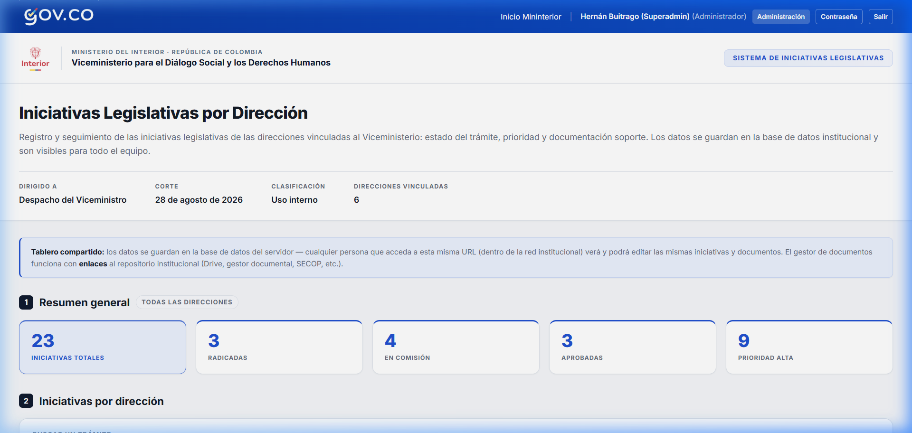

### 3.1. Barra superior GOV.CO

La franja azul en degradado (de izquierda a derecha) contiene:

- **Logo GOV.CO** (izquierda): enlaza al Portal Único del Estado Colombiano.
- **Enlace «Inicio Mininterior»**: lleva a la web del Ministerio.
- **Nombre del usuario** y su rol entre paréntesis (ej: *"Juan Pérez`n  (Administrador)"*).
- **Accesos rápidos**: Administración, Comunidades, Salir.

### 3.2. Franja institucional blanca

- **Logo del Ministerio del Interior** (izquierda).
- Separador vertical.
- **Epígrafe**: *"Ministerio del Interior · República de Colombia"*.
- **Nombre del Viceministerio**.
- **Etiqueta**: «Sistema de Iniciativas Legislativas» (derecha, solo en
  escritorio).

### 3.3. Cabecera de la página

- **Título**: *"Iniciativas Legislativas por Dirección"*.
- **Descripción**: explica el propósito del tablero.
- **Metadatos** (fila de cuatro columnas):

| Campo | Valor típico |
|---|---|
| Dirigido a | Despacho del Viceministro |
| Corte | 28 de agosto de 2026 |
| Clasificación | Uso interno |
| Direcciones vinculadas | 6 |

- **Aviso de tablero compartido** (franja azul claro): informa que los
  datos se guardan en la base institucional y son visibles para todo el
  equipo.

### 3.4. Resumen general (tarjetas KPI)

Cinco tarjetas con indicadores consolidados de **todas las direcciones**.

| Tarjeta | Qué muestra | Ejemplo |
|---|---|---|
| **Iniciativas totales** | Total activas en el sistema | 23 |
| **Radicadas** | En estado "Radicado" | 3 |
| **En comisión** | En estado "En comisión" | 4 |
| **Aprobadas** | En estado "Aprobado" | 3 |
| **Prioridad alta** | Marcadas como Alta | 9 |

**Las tarjetas son filtros**: pulse una para ver solo esas iniciativas.
Pulse de nuevo para quitar el filtro.

Debajo de las tarjetas dice *"Todas las direcciones"* para indicar que el
resumen es global.

### 3.5. Sección «Iniciativas por dirección»

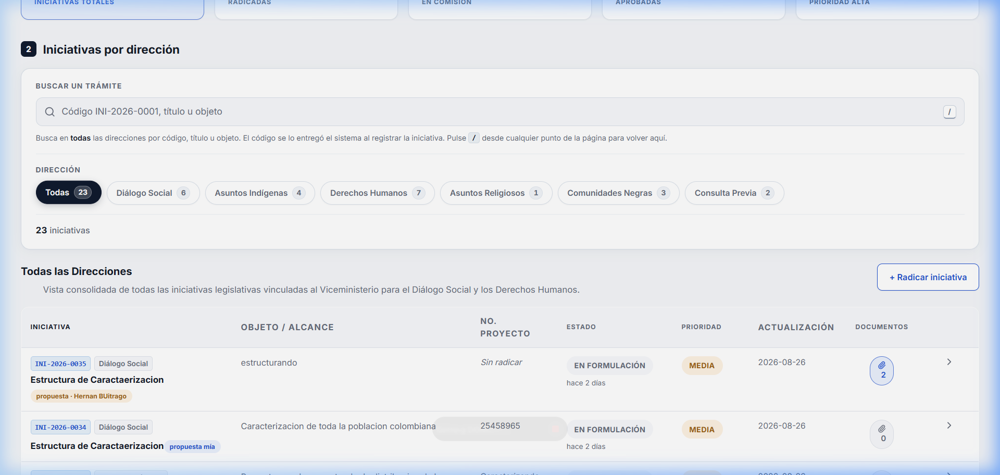

#### Buscador

Tarjeta con tres franjas:

1. **«Buscar un trámite»**: campo de texto con icono de lupa 🔍.
   - Busca por **código** (ej: `INI-2026-0001`), **título** u **objeto**.
   - **Atajo de teclado**: pulse `/` desde cualquier punto de la página.
   - **Escape**: limpia la búsqueda.
   - **Botón ×**: borra y devuelve el foco al campo.
   - Texto de ayuda: *"Busca en todas las direcciones…"*.

2. **«Dirección»**: fila de botones-píldora.
   - Escritorio: botones con nombre y cuenta: `Todas (23)`,
     `Diálogo Social (3)`, etc.
   - **Móvil (<860px)**: se convierte en un **desplegable (`<select>`)**.
   - El activo se pinta en azul oscuro con texto blanco.

3. **Resultado**: cuenta de iniciativas visibles: *"23 iniciativas"* o
   *"5 de 23"* si hay filtros.

#### Tabla de iniciativas

| Columna | Contenido |
|---|---|
| **Iniciativa** | Código (`INI-2026-0055`), etiqueta de dirección (`Consulta Previa`), título. Si es *iniciativa ciudadana*, lo indica. |
| **Objeto / Alcance** | Descripción del propósito |
| **N.° Proyecto** | Número de proyecto de ley: `PL-2026-013` |
| **Estado** | Etiqueta de color + tiempo: `EN FORMULACIÓN` *hace 6 días* |
| **Prioridad** | `MEDIA` (ámbar) o `ALTA` (rojo) |
| **Actualización** | Fecha: `2026-08-22` |
| **Documentos** | Ícono de clip 📎 |

**En móvil (<860px)**: la tabla se transforma en **tarjetas apiladas**.

> **Consejo:** pulse la **flecha `>`** al final de cualquier fila para
> abrir el panel de detalle.

### 3.6. Exportar a CSV

El botón **«Exportar N iniciativas a CSV»** descarga un archivo con las
iniciativas visibles (respetando los filtros activos).

### 3.7. Pie institucional

Réplica del pie de [mininterior.gov.co](https://www.mininterior.gov.co):
sedes, direcciones, teléfonos, redes sociales, políticas y logo GOV.CO.

---

## 4. Panel de detalle y acciones

Al pulsar una iniciativa se abre un **panel lateral deslizante** desde la
derecha.

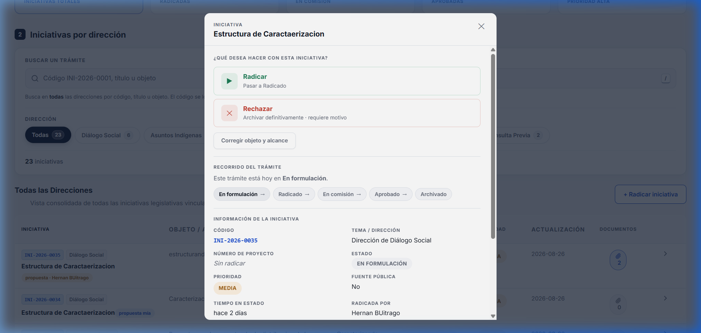

### 4.1. Acciones (arriba del todo)

**«¿Qué desea hacer con esta iniciativa?»** — tres tipos:

#### 🟢 Avanzar (borde verde)
Mover al siguiente estado del flujo:
- Ej: **"Radicar"** → *Pasar a Radicado*
- Ej: **"Enviar a comisión"** → *Pasar a En comisión*

#### 🟡 Devolver (borde ámbar)
Regresar al estado anterior:
- Ej: **"Devolver a formulación"** → **Motivo obligatorio**

#### 🔴 Rechazar (borde rojo)
Archivar definitivamente:
- Ej: **"Rechazar y archivar"** → **Motivo obligatorio**

**Paso a paso para mover una iniciativa:**

1. Pulse el botón de la acción deseada.
2. Aparece un **banner de confirmación** azul: *"Estado actual → Estado
   destino"*.
3. Escriba el **motivo** en el campo de texto:
   - **Obligatorio** para devolver y rechazar.
   - **Opcional** para avanzar.
4. Pulse **«Confirmar: [nombre de la acción]»**.
5. El movimiento queda registrado con su nombre, fecha y motivo.

> **¿No ve los botones?** Puede ser que:
> - No tiene `flujo.mover` en su rol.
> - El estado tiene responsables y usted no es uno.
> - Pida al administrador que lo asigne o que le dé `flujo.configurar`.

### 4.2. Recorrido del trámite

Línea de progreso visual horizontal:
- ✓ **Completados** (verde con palomita)
- ● **Estado actual** (resaltado con el color del estado)
- ○ **Pendientes** (gris)
- Flechas `→` entre cada paso

### 4.3. Información de la iniciativa

Datos en dos columnas:
- Código, dirección, número de proyecto, estado, prioridad
- Fuente pública, tiempo en estado
- Objeto y alcance (texto completo)
- Documentos adjuntos (enlaces)

### 4.4. Corregir objeto y alcance

Solo visible con el permiso `flujo.acotar`:

1. Pulse **«Corregir objeto y alcance»**.
2. Edite el texto.
3. Escriba el motivo (obligatorio).
4. Pulse **Guardar corrección**.

El texto anterior queda registrado en el historial.

### 4.5. Historial de movimientos

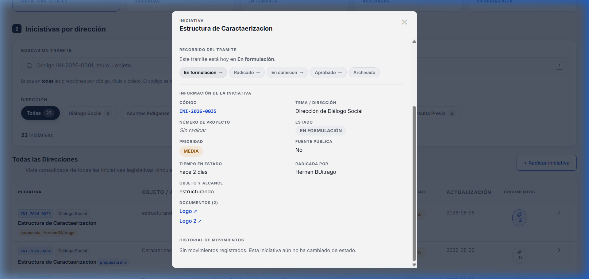

Línea de tiempo cronológica inversa:
- **Creación**: *"Creada por [nombre]"* + fecha
- **Movimientos**: *"[nombre] movió de Estado A → Estado B"* + motivo
- **Correcciones**: *"[nombre] corrigió el objeto"* + texto anterior
- Si no ha cambiado: *"Esta iniciativa aún no ha cambiado de estado."*

---

## 5. Zona administrativa

Accesible desde **Administración** en la barra superior. El menú lateral se
filtra por permisos.

**Navegación:**

- **Escritorio**: menú lateral colapsable (estilo Gmail). Al pasar el mouse
  se expande como superposición sin empujar el contenido.
- **Móvil**: barra inferior con iconos.
- Agrupado en: **Seguimiento** (Panel, Iniciativas) y **Gestión**
  (Usuarios, Roles, Configuración).
- **Volver al tablero** y **Cerrar sesión** en la parte inferior del menú.

---

### 5.1. Panel de control

**Ruta:** `/admin/panel` · **Permiso:** `iniciativas.ver_todas`

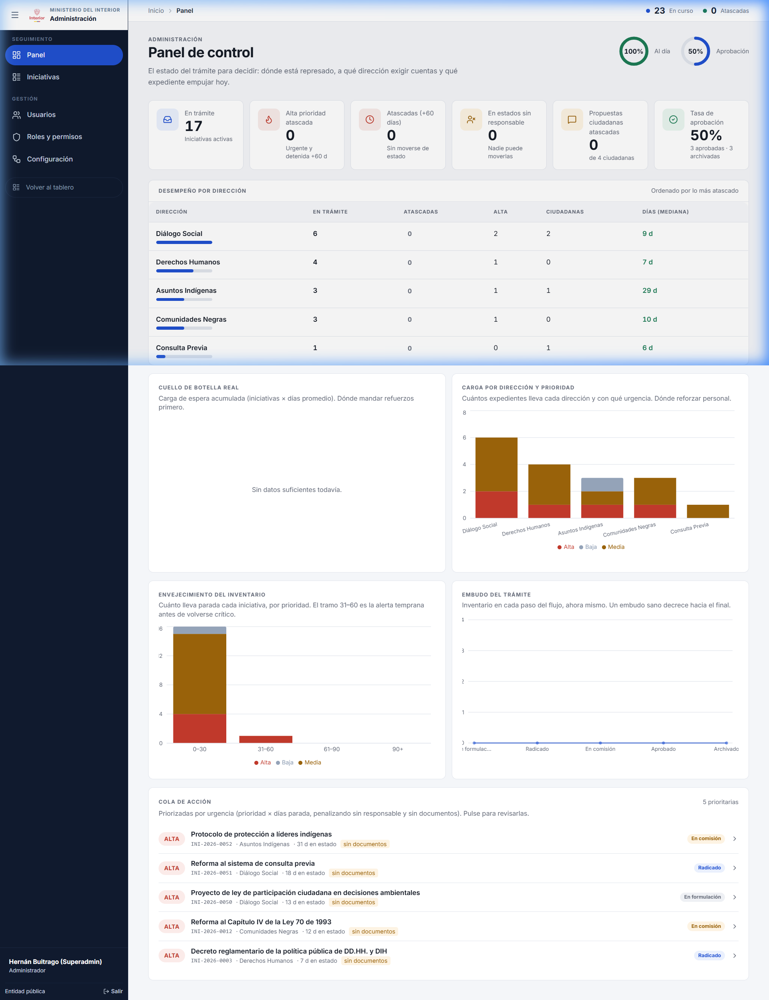

#### Indicadores KPI

| Indicador | Icono | Significado | Ejemplo |
|---|---|---|---|
| Iniciativas activas | 📊 | Total en el sistema | `17` |
| Al día | ✓ | % sin atraso | `94%` |
| Con responsable | 👤 | % con responsable asignado | `100%` |
| Atascadas | ⚠️ | +60 días sin movimiento | `1` |

#### Gráficos

| Gráfico | Tipo | Qué muestra |
|---|---|---|
| Embudo del trámite | Barras | Iniciativas por estado, en orden del flujo |
| Días promedio por estado | Área | Tiempo promedio en cada estado |
| Distribución por estado | Dona | Proporción visual del embudo |

#### Tabla «Requiere atención»

Iniciativas ordenadas por urgencia (más tiempo primero). Columnas:
Iniciativa, Estado, Tiempo, Prioridad, Acción (→).

---

### 5.2. Gestión de iniciativas

**Ruta:** `/admin/iniciativas` · **Permiso:** `iniciativas.ver_todas`

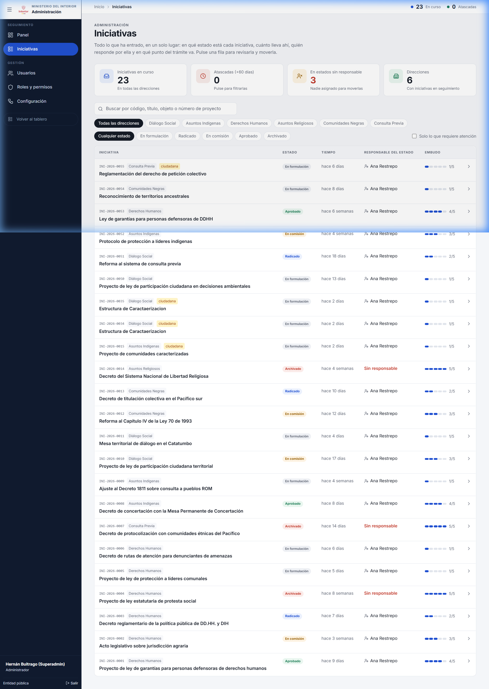

#### KPIs de gestión

| Indicador | Qué muestra |
|---|---|
| Total | Iniciativas en el sistema |
| Atascadas | +60 días sin movimiento |
| Sin responsable | En estados sin nadie asignado |
| Direcciones | Con iniciativas activas |

#### Filtros avanzados

| Filtro | Tipo | Función |
|---|---|---|
| Buscador | Texto | Código, título u objeto |
| Dirección | Desplegable | Filtrar por dirección |
| Estado | Desplegable | Filtrar por estado |
| Solo atascadas | Casilla | Aislar las represadas |

#### Tabla

| Columna | Contenido |
|---|---|
| Iniciativa | Código, dirección, título |
| Estado | Color + tiempo en ese estado |
| Responsable | Nombre(s) o ⚠️ «Sin responsable» |
| Prioridad | Media / Alta |
| Tiempo | Días en el estado actual |

#### Crear una iniciativa

1. Pulse **+ Radicar iniciativa**.
2. Complete: título (obligatorio), dirección (obligatorio), objeto, número
   de proyecto, prioridad.
3. Pulse **Guardar**.

---

### 5.3. Usuarios

**Ruta:** `/admin/usuarios` · **Permisos:** `usuarios.ver` / `usuarios.administrar`

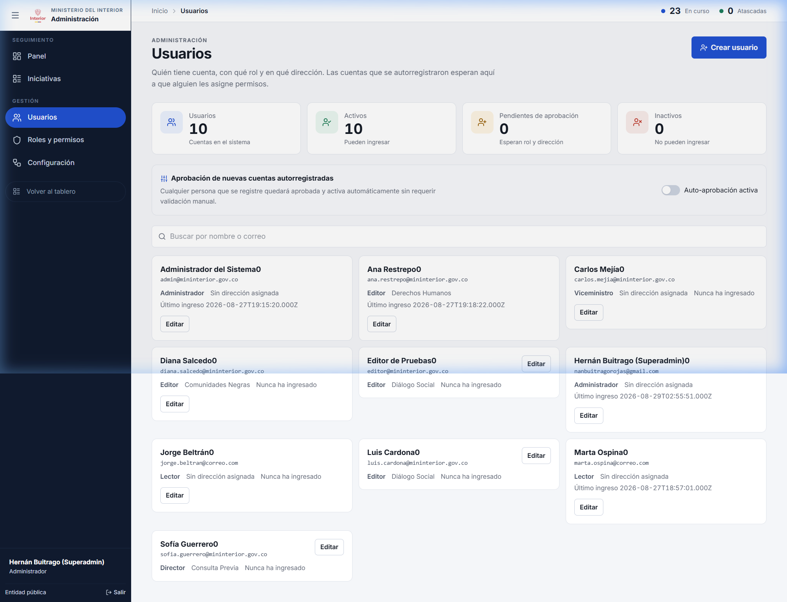

#### KPIs

| Indicador | Significado |
|---|---|
| Usuarios | Total de cuentas |
| Activos | Habilitadas |
| Inactivos | Deshabilitadas |
| Pendientes | Esperando aprobación |

#### Configuración de registro

Interruptor (solo con `usuarios.administrar`):

- **Exigir aprobación manual**: activado → las cuentas nuevas quedan
  pendientes. Desactivado → se activan con rol Lector.

#### Operaciones

| Acción | Cómo |
|---|---|
| **Ver usuarios** | Lista de tarjetas con nombre, correo, rol, dirección, estado |
| **Editar** | Pulse la tarjeta → modifique rol, dirección, estado → Guardar |
| **Crear** | Botón «Crear usuario» → nombre, correo, contraseña temporal, rol, dirección → Guardar |
| **Aprobar pendiente** | Localice la tarjeta con indicador «Pendiente» → asigne rol → active → Guardar |

> **Precaución:** al cambiar el rol, el efecto es **inmediato**. No
> necesita que el usuario cierre sesión.

---

### 5.4. Roles y permisos

**Ruta:** `/admin/roles` · **Permiso:** `roles.administrar`

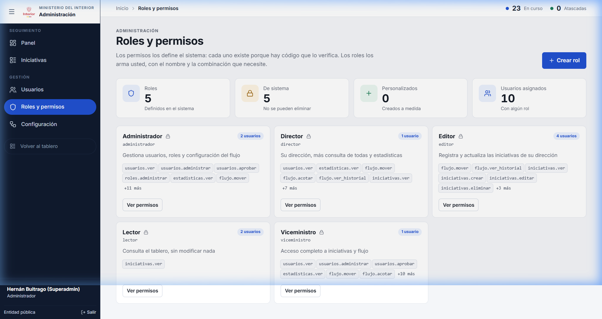

#### KPIs

| Indicador | Significado |
|---|---|
| Roles | Total definidos |
| De sistema | 🔒 Protegidos (no se eliminan) |
| Personalizados | Creados a medida |
| Usuarios asignados | Con algún rol |

#### Mosaico de roles

Cada tarjeta muestra: nombre, clave, descripción, cantidad de usuarios,
lista de permisos (insignias). Los de sistema llevan 🔒.

#### Operaciones

| Acción | Cómo |
|---|---|
| **Crear rol** | Botón «Crear rol» → nombre, clave, descripción → marque permisos → Guardar |
| **Editar rol** | Pulse tarjeta → modifique → Guardar |
| **Eliminar rol** | Solo roles personalizados (sin 🔒) |

> **Precaución:** revocar un permiso **surte efecto de inmediato**.

---

### 5.5. Configuración del flujo

**Ruta:** `/admin/flujo` · **Permiso:** `flujo.configurar`

Dos pestañas: **Estados** y **Direcciones**.

#### Pestaña: Estados

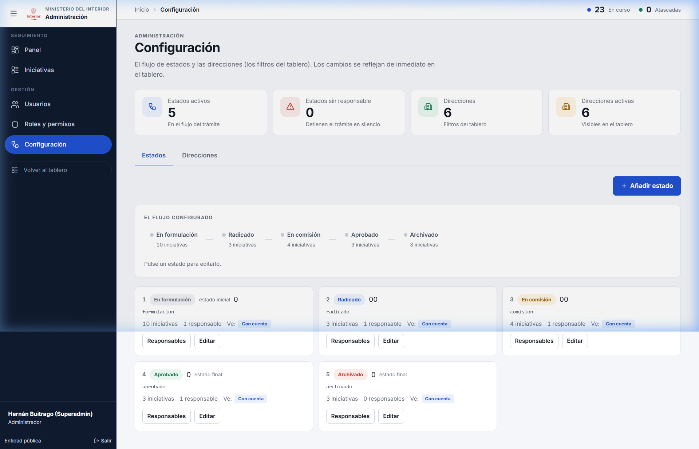

##### KPIs

| Indicador | Significado |
|---|---|
| Estados activos | En el flujo del trámite |
| Sin responsable | ⚠️ Detienen el trámite |
| Direcciones | En el catálogo |
| Direcciones activas | Visibles en el tablero |

##### Riel visual

Barra horizontal con las pastillas de cada estado en orden, conectadas
por flechas:

`En formulación → Radicado → En comisión → Aprobado → Archivado`

##### Tarjetas de estado

Cada una muestra: nombre, color, orden, responsables (con nombres y
permisos: avanzar/devolver/rechazar), visibilidad, si es final, si está
activo.

##### Operaciones con estados

| Acción | Cómo |
|---|---|
| **Crear** | Botón «Crear estado» → nombre, color, orden, visibilidad, final → Guardar |
| **Editar** | Pulse tarjeta → modifique → Guardar |
| **Gestionar responsables** | Pulse «Gestionar responsables» → agregar/quitar usuarios → configurar flags → Guardar |

> **Advertencia:** un estado **sin responsable** detiene el trámite en
> silencio. Solo administradores con `flujo.configurar` pueden
> desatrancar.

#### Pestaña: Direcciones

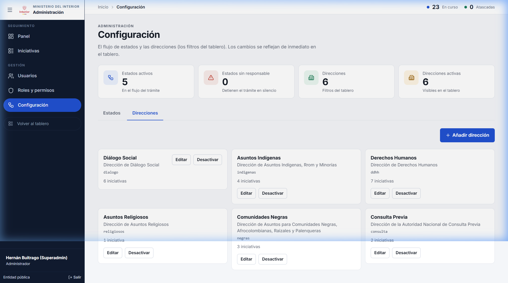

Cada tarjeta: nombre, clave, descripción, estado (activa/inactiva).

| Acción | Cómo |
|---|---|
| **Crear** | Botón «Crear dirección» → nombre, clave, descripción → Guardar |
| **Editar** | Pulse tarjeta → modifique → Guardar |
| **Desactivar** | No elimina iniciativas; solo oculta el filtro del tablero |

---

## 6. Flujo de estados de una iniciativa

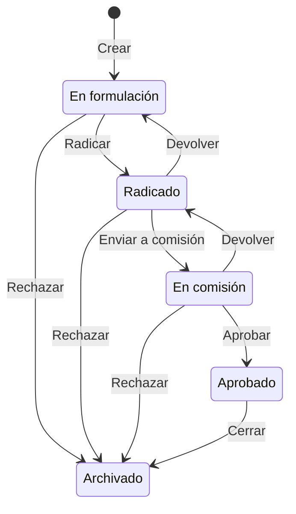

### Tabla de transiciones

| Desde | Acción | Tipo | Hacia | Motivo |
|---|---|---|---|---|
| En formulación | Radicar | 🟢 Avanzar | Radicado | Opcional |
| En formulación | Rechazar | 🔴 Rechazar | Archivado | **Obligatorio** |
| Radicado | Enviar a comisión | 🟢 Avanzar | En comisión | Opcional |
| Radicado | Devolver | 🟡 Devolver | En formulación | **Obligatorio** |
| Radicado | Rechazar | 🔴 Rechazar | Archivado | **Obligatorio** |
| En comisión | Aprobar | 🟢 Avanzar | Aprobado | Opcional |
| En comisión | Devolver | 🟡 Devolver | Radicado | **Obligatorio** |
| En comisión | Rechazar | 🔴 Rechazar | Archivado | **Obligatorio** |
| Aprobado | Cerrar | 🟢 Avanzar | Archivado | Opcional |

### ¿Quién puede mover?

| Condición | Resultado |
|---|---|
| Sin `flujo.mover` | No puede mover nada |
| Con `flujo.mover` + responsable del estado | Puede actuar según sus flags |
| Con `flujo.mover` + estado sin responsables | Puede actuar libremente |
| Con `flujo.configurar` | Puede mover **cualquier** iniciativa |

---

## 7. Catálogo de permisos

Los permisos son **del sistema**: cada uno existe porque hay código que lo
verifica. Los roles los agrupan.

### Iniciativas

| Permiso | Qué controla |
|---|---|
| `iniciativas.ver` | Ver iniciativas de su dirección |
| `iniciativas.ver_todas` | Ver de **todas** las direcciones |
| `iniciativas.ver_proponente` | Ver nombre del proponente ciudadano |
| `iniciativas.crear` | Crear (radicar) nuevas |
| `iniciativas.editar` | Editar datos existentes |
| `iniciativas.eliminar` | Eliminar |
| `iniciativas.exportar` | Exportar a CSV |

### Flujo

| Permiso | Qué controla |
|---|---|
| `flujo.mover` | Mover de un estado a otro |
| `flujo.acotar` | Corregir objeto y alcance (con constancia) |
| `flujo.ver_historial` | Ver línea de tiempo |
| `flujo.configurar` | Administrar estados/transiciones + mover cualquier iniciativa |

### Documentos

| Permiso | Qué controla |
|---|---|
| `documentos.gestionar` | Agregar y quitar adjuntos |

### Administración

| Permiso | Qué controla |
|---|---|
| `estadisticas.ver` | Gráficos y estadísticas |
| `usuarios.ver` | Lista de usuarios |
| `usuarios.aprobar` | Aprobar cuentas nuevas |
| `usuarios.administrar` | Crear, editar, desactivar |
| `roles.administrar` | Crear, editar, eliminar roles |

---

## 8. Preguntas frecuentes

### ¿Por qué no puedo mover una iniciativa?

**Tres causas:**
1. Su rol no incluye `flujo.mover`. → Pida al administrador que se lo
   asigne.
2. El estado tiene responsables y usted no es uno. → Pida que lo asignen
   en Configuración > Estados > Gestionar responsables.
3. El estado es final (Archivado). → No se puede mover.

### ¿Por qué no veo Administración?

Necesita al menos uno de: `iniciativas.ver_todas`, `usuarios.ver`,
`roles.administrar` o `flujo.configurar`.

### ¿Qué pasa cuando rechazo?

La iniciativa pasa a **Archivado** (estado final). El motivo queda en el
historial. Es irreversible desde la interfaz.

### ¿Puedo deshacer un movimiento?

No hay "deshacer". Use **Devolver** si el estado lo permite, o contacte
al administrador.

### ¿Qué significa "contraseña provisional"?

Bloquea la escritura hasta que la cambie. Verá un aviso amarillo en el
tablero.

### ¿Cómo asigno responsables a un estado?

`/admin/flujo` → tarjeta del estado → **Gestionar responsables** →
agregar usuarios → configurar flags → Guardar.

### ¿Qué es "tiempo en estado"?

Días desde el último movimiento. +60 días = **"atascada"**.

### ¿Cómo exporto las iniciativas?

Tablero → aplique filtros → **«Exportar N iniciativas a CSV»**.

### ¿Qué pasa si desactivo una dirección?

Las iniciativas **no se eliminan**. La dirección deja de aparecer como
filtro. Los datos se conservan.

### ¿Cómo sé si hay iniciativas atascadas?

Tres formas:
1. Tablero: tarjeta KPI "Prioridad alta".
2. `/admin/panel`: tabla "Requiere atención".
3. `/admin/iniciativas`: casilla "Solo atascadas".

---

> **Versión:** 2.0 — Verificado con capturas reales de la aplicación
> **Fecha:** 28 de agosto de 2026
> **Plataforma:** Sistema de Seguimiento de Iniciativas Legislativas v2
