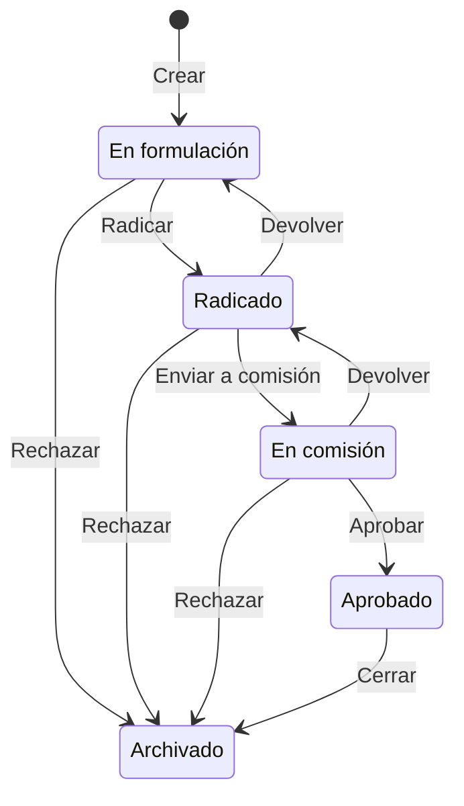

# Manual de Usuario — Sistema de Iniciativas Legislativas

**Viceministerio para el Diálogo Social y los Derechos Humanos**
Ministerio del Interior · República de Colombia

---

## Índice

1. [Generalidades](#1-generalidades)
2. [Acceso y autenticación](#2-acceso-y-autenticación)
3. [Tablero público](#3-tablero-público)
4. [Zona administrativa](#4-zona-administrativa)
   - 4.1 [Panel de control](#41-panel-de-control)
   - 4.2 [Gestión de iniciativas](#42-gestión-de-iniciativas)
   - 4.3 [Usuarios](#43-usuarios)
   - 4.4 [Roles y permisos](#44-roles-y-permisos)
   - 4.5 [Configuración del flujo](#45-configuración-del-flujo)
5. [Flujo de estados de una iniciativa](#5-flujo-de-estados-de-una-iniciativa)
6. [Catálogo de permisos](#6-catálogo-de-permisos)
7. [Preguntas frecuentes](#7-preguntas-frecuentes)

---

## 1. Generalidades

### ¿Qué es?

El **Sistema de Seguimiento de Iniciativas Legislativas** es una plataforma web que registra y da seguimiento a las iniciativas legislativas de las direcciones vinculadas al Viceministerio: estado del trámite, prioridad, documentación soporte y responsables.

### ¿Para quién?

| Perfil | Qué puede hacer |
|---|---|
| **Ciudadano** (sin cuenta) | Consultar el tablero público: ver iniciativas, filtrar por dirección, buscar por código |
| **Lector** (con cuenta) | Todo lo anterior + ver historial de movimientos |
| **Editor** | Todo lo anterior + crear, editar, eliminar iniciativas + mover de estado |
| **Director** | Todo lo anterior + ver todas las direcciones + estadísticas + acotar alcance |
| **Administrador** | Acceso completo: gestionar usuarios, roles, flujo y configuración |

### Rutas principales

| Ruta | Descripción |
|---|---|
| `/` | Tablero institucional (vista completa con sesión) |
| `/publico` | Tablero público (sin información sensible) |
| `/admin` | Zona administrativa |
| `/admin/panel` | Panel de control con indicadores |
| `/admin/iniciativas` | Gestión operativa de iniciativas |
| `/admin/usuarios` | Administración de cuentas |
| `/admin/roles` | Roles y permisos |
| `/admin/flujo` | Configuración de estados y direcciones |

---

## 2. Acceso y autenticación

### Iniciar sesión

1. Pulse el botón **Ingresar** en la barra superior azul.
2. Escriba su **correo electrónico** y **contraseña**.
3. Pulse **Ingresar**.

> [!NOTE]
> Si su cuenta tiene contraseña provisional, podrá consultar pero no modificar datos hasta que la cambie.

### Registrarse (autoservicio)

1. En el diálogo de ingreso, pulse **Crear cuenta**.
2. Complete: nombre, correo electrónico y contraseña.
3. Pulse **Registrarse**.
4. Su cuenta queda creada con el rol por defecto. Si la configuración exige aprobación manual, un administrador debe activarla.

> [!IMPORTANT]
> Tener cuenta **no es lo mismo que tener permisos**. Un administrador debe asignarle un rol con los permisos apropiados.

### Recuperar contraseña

1. En el diálogo de ingreso, pulse **¿Olvidó su contraseña?**
2. Escriba el correo registrado.
3. Recibirá instrucciones para restablecerla.

### Cambiar contraseña

1. Una vez logueado, pulse su nombre en la barra superior.
2. Seleccione **Cambiar contraseña**.
3. Ingrese la contraseña actual y la nueva (dos veces).

---

## 3. Tablero público

El tablero es la pantalla principal. Está organizado en secciones de arriba a abajo:

### 3.1. Barra superior GOV.CO

Franja azul con el logo oficial de GOV.CO, enlaces institucionales y el botón de sesión.

### 3.2. Franja institucional

Logo del Ministerio del Interior, nombre del Viceministerio y etiqueta "Sistema de Iniciativas Legislativas".

### 3.3. Cabecera de la página

- **Título**: "Iniciativas Legislativas por Dirección"
- **Metadatos**: dirigido a, fecha de corte, clasificación, número de direcciones vinculadas.
- **Aviso de tablero compartido**: informa que los datos son de lectura institucional.

### 3.4. Resumen general (KPIs)

Cuatro tarjetas con los indicadores consolidados de **todas las direcciones**:

| Tarjeta | Qué muestra |
|---|---|
| **Iniciativas totales** | Cantidad total de iniciativas activas en el sistema |
| **Radicadas** | Iniciativas en estado "Radicado" |
| **En comisión** | Iniciativas en estado "En comisión" |
| **Aprobadas** | Iniciativas en estado "Aprobado" |
| **Prioridad alta** | Iniciativas marcadas como prioridad Alta |

> [!TIP]
> Las tarjetas del resumen **son filtros**: pulse una para ver solo las iniciativas de esa categoría. Pulse de nuevo para quitar el filtro.

### 3.5. Iniciativas por dirección

#### Buscador

- Busque por **código** (ej: INI-2026-0001), **título** u **objeto**.
- Atajo de teclado: pulse `/` desde cualquier punto de la página para ir al buscador.
- Pulse `Esc` para limpiar la búsqueda.

#### Filtro de dirección

- **Escritorio**: botones con el nombre de cada dirección y la cuenta de iniciativas.
- **Móvil**: desplegable con las mismas opciones.
- El botón "Todas" muestra las iniciativas de todas las direcciones.
- Cada botón muestra la cuenta según los filtros de estado y prioridad aplicados.

### 3.6. Tabla de iniciativas

Cada fila muestra:

| Columna | Contenido |
|---|---|
| **Iniciativa** | Código, dirección y título. Si es iniciativa ciudadana, muestra la etiqueta. |
| **Objeto / Alcance** | Descripción del objeto de la iniciativa |
| **N.° Proyecto** | Número de proyecto de ley asignado |
| **Estado** | Etiqueta de color con el estado actual |
| **Prioridad** | Media / Alta / Sin asignar |
| **Actualización** | Fecha de la última actualización |
| **Documentos** | Ícono con acceso a los documentos adjuntos |

> [!TIP]
> **Pulse cualquier fila** para abrir el panel de detalle y acciones.

### 3.7. Panel de detalle y acciones

Al pulsar una fila se abre un panel lateral con:

#### Sección «¿Qué desea hacer con esta iniciativa?»

Aparecen botones agrupados por tipo de acción:

- 🟢 **Avanzar** (verde): mover al siguiente estado del flujo.
- 🟡 **Devolver** (ámbar): regresar al estado anterior. Requiere motivo.
- 🔴 **Rechazar** (rojo): archivar definitivamente. Requiere motivo.

Cada botón muestra:
- El **nombre de la acción** (ej: "Radicar", "Enviar a comisión")
- El **destino** (ej: "Pasar a Radicado")
- Si requiere motivo obligatorio

**Flujo de confirmación:**

1. Pulse el botón de la acción deseada.
2. Se muestra un **banner de confirmación** con el estado actual → destino.
3. Escriba el motivo (obligatorio para devolver/rechazar, opcional para avanzar).
4. Pulse **Confirmar: [acción]**.
5. El movimiento queda registrado en el historial con su nombre y la fecha.

> [!IMPORTANT]
> Solo los usuarios con el permiso `flujo.mover` ven las acciones. Los administradores con `flujo.configurar` pueden mover cualquier iniciativa sin ser responsables del estado.

#### Sección «Recorrido del trámite»

Una línea de progreso visual que muestra todos los estados del flujo:
- ✓ Estados **completados** (verde con palomita)
- ● Estado **actual** (resaltado con color)
- ○ Estados **pendientes** (gris)

#### Sección «Información de la iniciativa»

Datos completos en dos columnas: código, dirección, número de proyecto, estado, prioridad, fuente pública, tiempo en estado, objeto y alcance, documentos adjuntos.

#### Sección «Corregir objeto y alcance» (si tiene permiso `flujo.acotar`)

Permite corregir el objeto de la iniciativa con constancia en el historial:
1. Pulse **Corregir objeto y alcance**.
2. Edite el texto del objeto.
3. Escriba el motivo (obligatorio).
4. Pulse **Guardar corrección**.

El objeto anterior queda en el historial.

#### Sección «Historial de movimientos»

Línea de tiempo con todos los cambios:
- Creación de la iniciativa
- Movimientos de estado (con flecha: Estado A → Estado B)
- Correcciones de datos
- Acotamientos de alcance

Cada entrada muestra: **acción**, **usuario**, **fecha** y **motivo** (si aplica).

### 3.8. Exportar a CSV

El botón **Exportar N iniciativas a CSV** descarga las iniciativas visibles (respetando los filtros activos) en formato CSV.

### 3.9. Pie institucional

Réplica del pie de página de [mininterior.gov.co](https://www.mininterior.gov.co): sedes, direcciones, teléfonos, redes sociales, políticas y logo GOV.CO.

---

## 4. Zona administrativa

Accesible desde el enlace **Administración** en la barra superior. Requiere sesión y permisos.

### Navegación

- **Escritorio**: menú lateral colapsable (estilo Gmail). Pase el mouse para expandir.
- **Móvil**: barra inferior con iconos.

Las opciones del menú se filtran por permisos: solo se ven las secciones a las que el usuario tiene acceso.

| Sección | Permiso requerido |
|---|---|
| Panel | `iniciativas.ver_todas` |
| Iniciativas | `iniciativas.ver_todas` |
| Usuarios | `usuarios.ver` |
| Roles y permisos | `roles.administrar` |
| Configuración | `flujo.configurar` |

---

### 4.1. Panel de control

**Ruta:** `/admin/panel`
**Permiso:** `iniciativas.ver_todas`

Es el tablero de mando del administrador. Muestra:

#### Indicadores KPI

| Indicador | Qué muestra |
|---|---|
| **Iniciativas activas** | Total de iniciativas en el sistema |
| **Al día** | Porcentaje de iniciativas que no están atascadas |
| **Con responsable** | Porcentaje de iniciativas cuyo estado tiene al menos un responsable |
| **Atascadas** | Iniciativas que llevan demasiado tiempo en el mismo estado |

#### Gráficos

- **Embudo del trámite**: gráfico de barras con la cantidad de iniciativas por estado.
- **Días promedio por estado**: gráfico de área con cuánto tiempo en promedio dura una iniciativa en cada estado.
- **Distribución por estado**: gráfico de dona con la proporción.

#### Tabla de atención

Lista de las iniciativas que **requieren atención**: las que llevan más tiempo en su estado actual. Incluye quién es el responsable y cuántos días lleva parada. Pulse una fila para abrir el panel de acciones.

---

### 4.2. Gestión de iniciativas

**Ruta:** `/admin/iniciativas`
**Permiso:** `iniciativas.ver_todas`

Es el «cockpit» de operación. A diferencia del tablero público, aquí:

#### Filtros disponibles

- **Buscador**: por código, título u objeto.
- **Dirección**: desplegable para filtrar por dirección.
- **Estado**: desplegable para filtrar por estado del flujo.
- **Solo atascadas**: interruptor para ver solo las que llevan demasiado tiempo.

#### Tabla de gestión

Cada fila muestra:

| Columna | Contenido |
|---|---|
| **Iniciativa** | Código, dirección y título |
| **Estado** | Con color y tiempo en ese estado |
| **Responsable** | Quién es responsable del estado actual |
| **Prioridad** | Media / Alta |
| **Tiempo** | Cuántos días lleva en el estado actual |

#### Acciones

- **Pulse una fila** para abrir el panel de detalle y mover de estado.
- **+ Radicar iniciativa**: botón para crear una nueva iniciativa.

#### Crear una iniciativa

1. Pulse **+ Radicar iniciativa**.
2. Complete los campos:
   - **Nombre** (obligatorio): título de la iniciativa.
   - **Dirección** (obligatorio): dirección que la gestiona.
   - **Objeto y alcance**: descripción del propósito.
   - **Número de proyecto**: si ya tiene radicado.
   - **Prioridad**: Media o Alta.
   - **Fuente pública**: si es de conocimiento público.
3. Pulse **Guardar**.

---

### 4.3. Usuarios

**Ruta:** `/admin/usuarios`
**Permiso:** `usuarios.ver` (consulta) · `usuarios.administrar` (gestión)

#### Indicadores KPI

| Indicador | Significado |
|---|---|
| **Usuarios** | Total de cuentas en el sistema |
| **Activos** | Cuentas habilitadas |
| **Inactivos** | Cuentas deshabilitadas |
| **Pendientes** | Cuentas que esperan aprobación manual |

#### Configuración de registro

Si tiene `usuarios.administrar`, puede activar/desactivar:
- **Exigir aprobación manual**: cuando está activo, las cuentas autorregistradas quedan pendientes hasta que un administrador las apruebe.

#### Lista de usuarios

Cada tarjeta de usuario muestra:
- **Nombre y correo**
- **Rol asignado** (con insignia de color)
- **Dirección** a la que pertenece
- **Estado**: activo/inactivo
- **Pendiente de aprobación**: si aplica

#### Editar un usuario

1. Pulse la tarjeta del usuario.
2. Puede modificar:
   - **Rol**: seleccione entre los roles disponibles.
   - **Dirección**: la dirección donde trabaja.
   - **Estado**: activo/inactivo.
3. Pulse **Guardar**.

#### Crear un usuario

1. Pulse **Crear usuario** (requiere `usuarios.administrar`).
2. Complete: nombre, correo, contraseña temporal, rol, dirección.
3. Pulse **Guardar**.

> [!WARNING]
> Las contraseñas provisionales bloquean la escritura hasta que el usuario las cambie.

#### Aprobar cuentas pendientes

Si hay cuentas autorregistradas pendientes, aparece un aviso con la cantidad. Pulse la tarjeta del usuario pendiente, asígnele un rol y active la cuenta.

---

### 4.4. Roles y permisos

**Ruta:** `/admin/roles`
**Permiso:** `roles.administrar`

#### Indicadores KPI

| Indicador | Significado |
|---|---|
| **Roles** | Total de roles definidos |
| **De sistema** | Roles protegidos que no se pueden eliminar |
| **Personalizados** | Roles creados a medida |
| **Usuarios asignados** | Total de usuarios con algún rol |

#### Roles existentes

Cada tarjeta de rol muestra:
- **Nombre y clave** del rol
- **Descripción**
- **Cantidad de usuarios** con ese rol
- **Lista de permisos** asignados
- 🔒 Los roles de sistema no se pueden eliminar

#### Crear un rol

1. Pulse **Crear rol**.
2. Complete:
   - **Nombre**: nombre visible (ej: "Coordinador").
   - **Clave**: identificador único (ej: "coordinador").
   - **Descripción**: para qué sirve este rol.
3. **Marque los permisos** que incluye (ver [Catálogo de permisos](#6-catálogo-de-permisos)).
4. Pulse **Guardar**.

#### Editar un rol

1. Pulse la tarjeta del rol.
2. Modifique nombre, descripción o permisos.
3. Pulse **Guardar**.

> [!CAUTION]
> Revocar un permiso **surte efecto de inmediato** en la siguiente petición del usuario, sin necesidad de que cierre sesión.

---

### 4.5. Configuración del flujo

**Ruta:** `/admin/flujo`
**Permiso:** `flujo.configurar`

Tiene dos pestañas: **Estados** y **Direcciones**.

#### Indicadores KPI

| Indicador | Significado |
|---|---|
| **Estados activos** | Estados visibles en el flujo del trámite |
| **Sin responsable** | Estados que no tienen a nadie asignado (⚠ detienen el trámite) |
| **Direcciones** | Total de direcciones en el catálogo |
| **Direcciones activas** | Las que aparecen como filtro en el tablero |

#### Pestaña: Estados

Muestra el **riel visual del flujo** (la secuencia de estados) y debajo cada estado como tarjeta con:

- **Nombre y color** del estado
- **Orden** en el flujo
- **Responsables asignados** (con nombres)
- **Visibilidad**: quién puede ver las iniciativas en este estado
- **Es estado final**: si la iniciativa termina aquí (ej: Archivado)

**Crear un estado:**
1. Pulse **Crear estado**.
2. Complete: nombre, color, orden, visibilidad, si es final.
3. Pulse **Guardar**.

**Editar un estado:**
1. Pulse la tarjeta del estado.
2. Modifique los campos necesarios.
3. Pulse **Guardar**.

**Asignar responsables a un estado:**
1. Pulse el enlace **"Gestionar responsables"** en la tarjeta del estado.
2. Agregue o quite usuarios como responsables.
3. Configure para cada responsable si puede: avanzar, devolver, rechazar, cerrar.

> [!WARNING]
> Un estado **sin responsable** detiene el trámite en silencio: ningún usuario regular podrá mover la iniciativa. Solo administradores con `flujo.configurar` podrán desatrancarla.

#### Pestaña: Direcciones

Lista de las direcciones (los filtros del tablero). Cada tarjeta muestra:
- **Nombre** de la dirección
- **Clave**: identificador interno
- **Estado**: activa/inactiva
- **Cantidad de iniciativas** asociadas

**Crear una dirección:**
1. Pulse **Crear dirección**.
2. Complete: nombre, clave.
3. Pulse **Guardar**.

**Editar una dirección:**
1. Pulse la tarjeta de la dirección.
2. Modifique nombre o estado (activa/inactiva).
3. Pulse **Guardar**.

---

## 5. Flujo de estados de una iniciativa

### Tabla de transiciones

| Desde | Acción | Hacia | Motivo |
|---|---|---|---|
| En formulación | **Radicar** | Radicado | Opcional |
| En formulación | **Rechazar** | Archivado | **Obligatorio** |
| Radicado | **Enviar a comisión** | En comisión | Opcional |
| Radicado | **Devolver a formulación** | En formulación | **Obligatorio** |
| Radicado | **Rechazar** | Archivado | **Obligatorio** |
| En comisión | **Aprobar** | Aprobado | Opcional |
| En comisión | **Devolver a radicación** | Radicado | **Obligatorio** |
| En comisión | **Rechazar** | Archivado | **Obligatorio** |
| Aprobado | **Cerrar y archivar** | Archivado | Opcional |

### ¿Quién puede mover una iniciativa?

1. El usuario debe tener el permiso **`flujo.mover`**.
2. Si el estado tiene **responsables asignados**, solo ellos pueden actuar (según sus flags: avanzar, devolver, rechazar).
3. Si el estado **no tiene responsables**, cualquiera con `flujo.mover` puede actuar.
4. Los administradores con **`flujo.configurar`** pueden mover **cualquier** iniciativa, sin importar si son responsables.

---

## 6. Catálogo de permisos

Los permisos son **del sistema**: cada uno existe porque hay código que lo verifica. Los roles agrupan permisos.

| Permiso | Qué controla |
|---|---|
| `iniciativas.ver` | Ver iniciativas de su dirección |
| `iniciativas.ver_todas` | Ver iniciativas de **todas** las direcciones |
| `iniciativas.ver_proponente` | Ver el nombre de quien radicó una iniciativa ciudadana |
| `iniciativas.crear` | Crear (radicar) nuevas iniciativas |
| `iniciativas.editar` | Editar datos de iniciativas existentes |
| `iniciativas.eliminar` | Eliminar iniciativas |
| `iniciativas.exportar` | Exportar a CSV |
| `documentos.gestionar` | Agregar y quitar documentos adjuntos |
| `flujo.mover` | Mover iniciativas de un estado a otro |
| `flujo.acotar` | Corregir el objeto y alcance de una iniciativa |
| `flujo.ver_historial` | Ver el historial de movimientos de una iniciativa |
| `flujo.configurar` | Administrar estados, transiciones y responsables |
| `estadisticas.ver` | Ver estadísticas y gráficos del panel |
| `usuarios.ver` | Ver la lista de usuarios |
| `usuarios.aprobar` | Aprobar cuentas autorregistradas |
| `usuarios.administrar` | Crear, editar y desactivar usuarios |
| `roles.administrar` | Crear, editar y eliminar roles |

---

## 7. Preguntas frecuentes

### ¿Por qué no puedo mover una iniciativa?

Puede deberse a:
- Su rol no incluye el permiso `flujo.mover`.
- El estado actual tiene responsables asignados y usted no es uno de ellos.
- Solución: pida al administrador que le asigne como responsable del estado, o que le dé un rol con `flujo.configurar`.

### ¿Por qué no veo la sección de Administración?

La sección `/admin` requiere al menos uno de los permisos que habilitan las pestañas (`iniciativas.ver_todas`, `usuarios.ver`, `roles.administrar` o `flujo.configurar`). Si su rol no incluye ninguno, no verá el enlace.

### ¿Qué pasa cuando rechazo una iniciativa?

Se mueve al estado **Archivado**, que es un estado final. El motivo del rechazo queda registrado en el historial con su nombre y la fecha. Es irreversible desde la interfaz normal.

### ¿Puedo deshacer un movimiento?

No existe una acción de "deshacer". Si movió una iniciativa por error, use la acción **Devolver** si el estado lo permite, o contacte al administrador.

### ¿Qué significa "contraseña provisional"?

Cuando un administrador crea una cuenta con contraseña temporal, el sistema bloquea la escritura hasta que el usuario la cambie. Podrá consultar pero no modificar datos.

### ¿Cómo asigno responsables a un estado?

1. Vaya a `/admin/flujo`.
2. Pulse la tarjeta del estado.
3. Pulse **Gestionar responsables**.
4. Agregue usuarios y configure qué acciones pueden realizar.

### ¿Qué es el "tiempo en estado"?

Es la cantidad de días que lleva la iniciativa en el estado actual. Se calcula desde la fecha del último movimiento. En el panel de control, las iniciativas con mucho tiempo en un estado se marcan como **"atascadas"** y requieren atención.

### ¿Cómo exporto las iniciativas?

En el tablero, aplique los filtros que necesite y pulse el botón **Exportar N iniciativas a CSV** al final de la tabla. Se descarga un archivo con las columnas visibles.

---

> **Versión del manual:** 1.0
> **Fecha:** Agosto de 2026
> **Plataforma:** Sistema de Seguimiento de Iniciativas Legislativas v2
