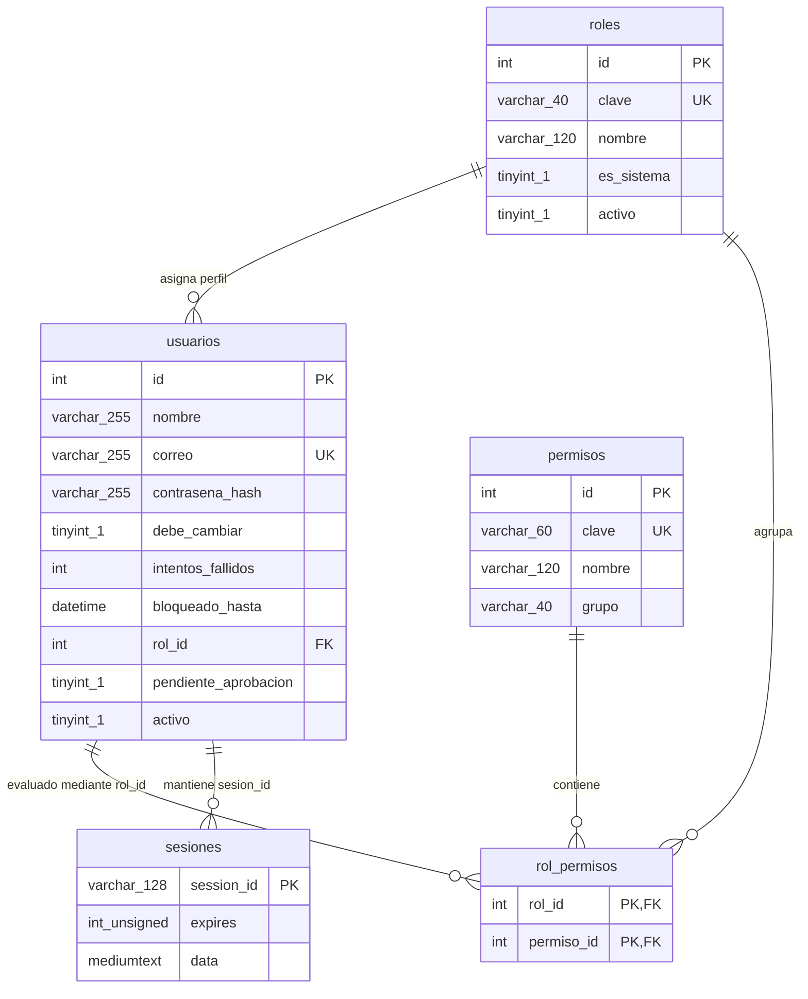
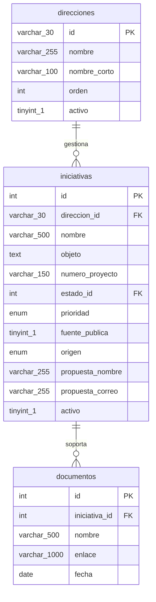
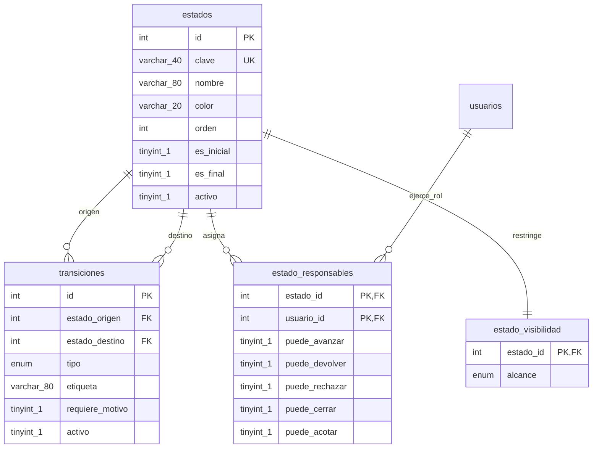
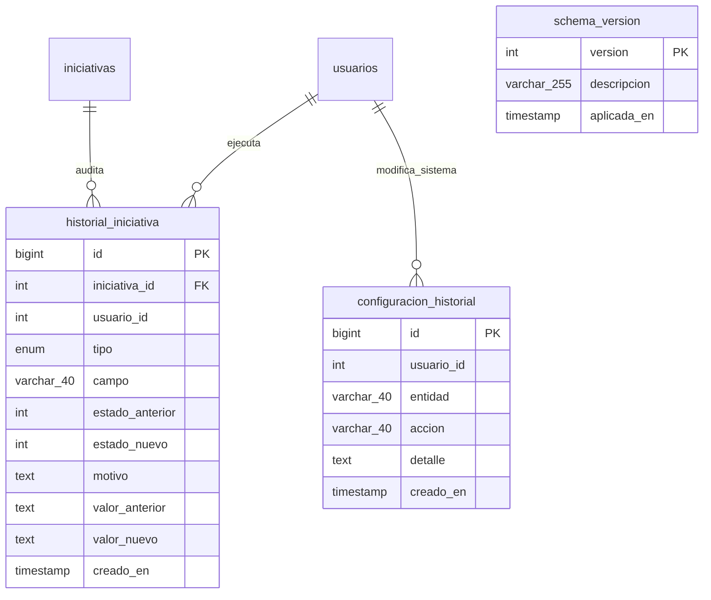

# Modelo de Datos y Diagrama Entidad-Relación (ERD) — Nivel 3

**Viceministerio para el Diálogo Social y los Derechos Humanos**  
Ministerio del Interior · República de Colombia  
**Plataforma:** Sistema de Seguimiento de Iniciativas Legislativas  
**Entorno de Producción:** `https://mininterior-iniciativas.fabricasoftware.co/`  
**Motor de Base de Datos:** MySQL 8.4 Community Server (InnoDB, `utf8mb4_unicode_ci`)  
**Versión del Esquema:** 18 (Migraciones 01 → 18) · **Fecha:** 28 de agosto de 2026

---

## Índice

1. [Resumen Ejecutivo de la Arquitectura de Datos](#1-resumen-ejecutivo-de-la-arquitectura-de-datos)
2. [Diagrama Entidad-Relación Global (Nivel 3 - Físico)](#2-diagrama-entidad-relación-global-nivel-3---físico)
3. [Diagramas por Dominios Funcionales](#3-diagramas-por-dominios-funcionales)
   - 3.1 [Dominio de Identidad, Autenticación y RBAC](#31-dominio-de-identidad-autenticación-y-rbac)
   - 3.2 [Dominio Core: Iniciativas Legislativas y Expediente Documental](#32-dominio-core-iniciativas-legislativas-y-expediente-documental)
   - 3.3 [Dominio de Máquina de Estados y Flujo Dinámico](#33-dominio-de-máquina-de-estados-y-flujo-dinámico)
   - 3.4 [Dominio de Auditoría, Trazabilidad y Control del Esquema](#34-dominio-de-auditoría-trazabilidad-y-control-del-esquema)
4. [Diccionario Exhaustivo de Datos (15 Tablas)](#4-diccionario-exhaustivo-de-datos-15-tablas)
   - 4.1 [Tabla: `direcciones`](#41-tabla-direcciones)
   - 4.2 [Tabla: `iniciativas`](#42-tabla-iniciativas)
   - 4.3 [Tabla: `documentos`](#43-tabla-documentos)
   - 4.4 [Tabla: `estados`](#44-tabla-estados)
   - 4.5 [Tabla: `transiciones`](#45-tabla-transiciones)
   - 4.6 [Tabla: `estado_responsables`](#46-tabla-estado_responsables)
   - 4.7 [Tabla: `estado_visibilidad`](#47-tabla-estado_visibilidad)
   - 4.8 [Tabla: `historial_iniciativa`](#48-tabla-historial_iniciativa)
   - 4.9 [Tabla: `usuarios`](#49-tabla-usuarios)
   - 4.10 [Tabla: `roles`](#410-tabla-roles)
   - 4.11 [Tabla: `permisos`](#411-tabla-permisos)
   - 4.12 [Tabla: `rol_permisos`](#412-tabla-rol_permisos)
   - 4.13 [Tabla: `sesiones`](#413-tabla-sesiones)
   - 4.14 [Tabla: `configuracion_historial`](#414-tabla-configuracion_historial)
   - 4.15 [Tabla: `schema_version`](#415-tabla-schema_version)
5. [Matriz de Integridad Referencial y Cardinalidades](#5-matriz-de-integridad-referencial-y-cardinalidades)
6. [Catálogo de Procedimientos Almacenados y Funciones](#6-catálogo-de-procedimientos-almacenados-y-funciones)
7. [Políticas de Seguridad, Transaccionalidad y Concurrencia](#7-políticas-de-seguridad-transaccionalidad-y-concurrencia)

---

## 1. Resumen Ejecutivo de la Arquitectura de Datos

El diseño de base de datos del **Sistema de Seguimiento de Iniciativas Legislativas** implementa un modelo relacional normalizado (3NF) gobernado por una capa estricta de **procedimientos almacenados (`Stored Procedures`)**.

### Principales directrices de ingeniería:

1. **Encapsulamiento y Seguridad por Construcción:**  
   La API no emite sentencias SQL directas (`SELECT`, `INSERT`, `UPDATE`, `DELETE`) ni ejecuta interpolación de cadenas. Todas las transacciones se despachan mediante invocaciones parametrizadas `CALL sp_nombre(?, ?)`, eliminando de raíz vulnerabilidades de inyección SQL.
2. **Control de Acceso Basado en Permisos Granulares (RBAC Dinámico):**  
   Los roles agrupan permisos del catálogo del sistema. La función booleana determinística `fn_tiene_permiso(usuario_id, clave_permiso)` resuelve los privilegios en tiempo de ejecución.
3. **Máquina de Estados Finita (FSM) Configurable:**  
   El ciclo de vida de una iniciativa legislativa es desacoplado del código fuente y modelado dinámicamente en tablas (`estados`, `transiciones`, `estado_responsables`, `estado_visibilidad`).
4. **Trazabilidad y No Repudio (Auditoría Integral):**  
   Todo cambio de estado, corrección de alcance o edición de campos queda asentado en `historial_iniciativa` con marca de tiempo, usuario actor, estado anterior, estado nuevo y justificación motivada obligatoria.
5. **Idempotencia y Versionado del Esquema:**  
   La tabla `schema_version` asegura la trazabilidad de las 18 migraciones ejecutadas por el servicio `migrador`.

---

## 2. Diagrama Entidad-Relación Global (Nivel 3 - Físico)

A continuación se presenta el modelo físico completo con tipado estricto, claves primarias (`PK`), claves foráneas (`FK`), índices únicos (`UK`) e índices de búsqueda (`IX`).

```mermaid
erDiagram
    direcciones ||--o{ iniciativas : "fk_iniciativas_direccion (ON DELETE CASCADE ON UPDATE CASCADE)"
    direcciones ||--o{ usuarios : "fk_usuarios_direccion (ON DELETE SET NULL ON UPDATE CASCADE)"
    
    iniciativas ||--o{ documentos : "fk_documentos_iniciativa (ON DELETE CASCADE ON UPDATE CASCADE)"
    iniciativas ||--o{ historial_iniciativa : "fk_hi_iniciativa (ON DELETE CASCADE)"
    estados ||--o{ iniciativas : "asocia estado_id (Lógico)"
    
    estados ||--o{ transiciones : "fk_tr_origen (ON DELETE CASCADE)"
    estados ||--o{ transiciones : "fk_tr_destino (ON DELETE CASCADE)"
    estados ||--o{ estado_responsables : "fk_er_estado (ON DELETE CASCADE)"
    estados ||--|| estado_visibilidad : "fk_ev_estado (ON DELETE CASCADE)"
    
    usuarios ||--o{ estado_responsables : "fk_er_usuario (ON DELETE CASCADE)"
    roles ||--o{ usuarios : "asocia rol_id (Lógico / Index)"
    
    roles ||--o{ rol_permisos : "fk_rp_rol (ON DELETE CASCADE)"
    permisos ||--o{ rol_permisos : "fk_rp_permiso (ON DELETE CASCADE)"
    
    usuarios ||--o{ historial_iniciativa : "asocia usuario_id (Auditoría)"
    usuarios ||--o{ configuracion_historial : "asocia usuario_id (Auditoría)"
    
    direcciones {
        varchar_30 id PK "Identificador alfanumérico único (slug)"
        varchar_255 nombre "Nombre oficial de la dependencia"
        varchar_100 nombre_corto "Nombre abreviado institucional"
        text descripcion "Alcance y funciones de la dirección"
        int orden "Secuencia de despliegue en interfaces"
        tinyint_1 activo "Bandera de disponibilidad lógica"
        timestamp creado_en "Timestamp de inserción del registro"
    }

    iniciativas {
        int id PK "Identificador numérico autoincremental"
        varchar_30 direccion_id FK "Dependencia encargada del trámite"
        varchar_500 nombre "Título oficial de la iniciativa legislativa"
        text objeto "Objeto, alcance y justificación jurídica"
        varchar_150 numero_proyecto "Radicado oficial de Congreso (PL/PR)"
        enum estado "Estado legacy para retrocompatibilidad"
        int estado_id FK "Clave foránea al estado del flujo FSM"
        enum prioridad "Alta | Media | Baja"
        date fecha_actualizacion "Última fecha de gestión formal"
        tinyint_1 fuente_publica "Bandera de trámite de notoriedad pública"
        tinyint_1 activo "Bandera de borrado lógico (1=Activo, 0=Inactivo)"
        timestamp creado_en "Fecha y hora de radicación / creación"
        timestamp actualizado_en "Fecha y hora de última modificación"
        enum origen "interna | propuesta"
        int propuesta_por FK "ID de usuario ciudadano creador (opcional)"
        varchar_255 propuesta_nombre "Nombre proponente ciudadano"
        varchar_255 propuesta_correo "Correo proponente ciudadano"
        datetime propuesta_en "Fecha/hora de propuesta externa"
    }

    documentos {
        int id PK "Identificador único de documento"
        int iniciativa_id FK "Iniciativa a la que pertenece el anexo"
        varchar_500 nombre "Descripción o nombre del archivo"
        varchar_1000 enlace "URL o ruta física de almacenamiento"
        date fecha "Fecha formal de expedición del documento"
        timestamp creado_en "Timestamp de carga al expediente"
    }

    estados {
        int id PK "Identificador único del estado"
        varchar_40 clave UK "Clave mnemotécnica única (slug)"
        varchar_80 nombre "Etiqueta visible para el usuario"
        varchar_300 descripcion "Guía técnica u objetivo del estado"
        varchar_20 color "Token cromático UI (azul, morado, verde...)"
        int orden "Posición en la cadena secuencial"
        tinyint_1 es_inicial "Flag de estado de radicación inicial"
        tinyint_1 es_final "Flag de estado terminal (aprobado/archivado)"
        tinyint_1 activo "Flag de estado vigente en la plataforma"
    }

    transiciones {
        int id PK "Identificador único de la transición"
        int estado_origen FK "Estado previo requerido"
        int estado_destino FK "Estado objetivo alcanzable"
        enum tipo "avanzar | devolver | rechazar | cerrar"
        varchar_80 etiqueta "Texto del botón de acción (UI)"
        tinyint_1 requiere_motivo "Obligatoriedad de justificación textual"
        tinyint_1 activo "Transición habilitada"
    }

    estado_responsables {
        int estado_id PK,FK "Estado del flujo asignado"
        int usuario_id PK,FK "Funcionario autorizado para operar"
        tinyint_1 puede_avanzar "Permiso para ejecutar transiciones hacia adelante"
        tinyint_1 puede_devolver "Permiso para devolver a estados previos"
        tinyint_1 puede_rechazar "Permiso para archivar/rechazar"
        tinyint_1 puede_cerrar "Permiso para cierre administrativo"
        tinyint_1 puede_acotar "Permiso para modificar alcance en el estado"
    }

    estado_visibilidad {
        int estado_id PK,FK "Estado regulado por la directriz"
        enum alcance "publico | autenticado | direccion | responsables"
    }

    historial_iniciativa {
        bigint id PK "Identificador único del evento"
        int iniciativa_id FK "Iniciativa afectada por la operación"
        int usuario_id "Usuario autor del cambio"
        enum tipo "avanzar | devolver | rechazar | cerrar | acotar | creacion | edicion"
        varchar_40 campo "Columna afectada en eventos de tipo edición"
        int estado_anterior "Estado previo en la transición"
        int estado_nuevo "Nuevo estado asignado"
        text motivo "Justificación obligatoria del movimiento"
        text valor_anterior "Valor preexistente en modificaciones"
        text valor_nuevo "Valor actualizado en modificaciones"
        timestamp creado_en "Fecha y hora exacta del suceso"
    }

    usuarios {
        int id PK "Identificador único de cuenta"
        varchar_255 nombre "Nombre completo y apellidos"
        varchar_255 correo UK "Correo electrónico institucional o personal"
        varchar_255 contrasena_hash "Hash criptográfico bcrypt / scrypt"
        tinyint_1 debe_cambiar "Requiere cambio de contraseña en login"
        int intentos_fallidos "Contador de autenticaciones fallidas"
        datetime bloqueado_hasta "Bloqueo temporal por fuerza bruta"
        datetime ultimo_ingreso "Registro de última sesión establecida"
        varchar_30 direccion_id FK "Dirección de adscripción institucional"
        enum rol "Rol legacy (viceministro, director, editor, lector)"
        int rol_id "Rol dinámico asignado del catálogo RBAC"
        tinyint_1 pendiente_aprobacion "Cuenta en cola de validación manual"
        datetime registrado_en "Fecha de registro por autoservicio"
        tinyint_1 activo "Estado de la cuenta (1=Habilitada, 0=Deshabilitada)"
        timestamp creado_en "Fecha de creación del registro"
    }

    roles {
        int id PK "Identificador único del rol"
        varchar_40 clave UK "Identificador mnemotécnico único"
        varchar_120 nombre "Nombre descriptivo del rol"
        varchar_255 descripcion "Alcance y perfil funcional"
        tinyint_1 es_sistema "Protección contra borrado (1=Inmutable)"
        tinyint_1 activo "Disponibilidad del rol"
        timestamp creado_en "Fecha de creación"
    }

    permisos {
        int id PK "Identificador único del permiso"
        varchar_60 clave UK "Clave técnica evaluada por la API"
        varchar_120 nombre "Nombre formal del permiso"
        varchar_255 descripcion "Acción específica que autoriza"
        varchar_40 grupo "Módulo funcional de pertenencia"
        int orden "Orden de despliegue en matriz"
    }

    rol_permisos {
        int rol_id PK,FK "Rol al que se asocia la capacidad"
        int permiso_id PK,FK "Permiso concedido al rol"
    }

    sesiones {
        varchar_128 session_id PK "Token de sesión en cookie segura"
        int_unsigned expires "Timestamp UNIX de expiración"
        mediumtext data "Payload serializado de express-session"
    }

    configuracion_historial {
        bigint id PK "Registro de auditoría administrativa"
        int usuario_id "Administrador que ejecutó la operación"
        varchar_40 entidad "Objeto configurado (roles, estados...)"
        varchar_40 accion "Tipo de operación (crear, editar...)"
        text detalle "Carga JSON o descripción del cambio"
        timestamp creado_en "Fecha y hora del cambio de configuración"
    }

    schema_version {
        int version PK "Número correlativo de la migración aplicada"
        varchar_255 descripcion "Descripción del parche estructural"
        timestamp aplicada_en "Fecha y hora de ejecución por el migrador"
    }
```



---

## 3. Diagramas por Dominios Funcionales

### 3.1. Dominio de Identidad, Autenticación y RBAC

Controla la identidad de los usuarios, políticas de contraseñas provisionales, bloqueos por intentos fallidos, persistencia distribuida de sesiones y el árbol de privilegios por permisos atómicos.



---

### 3.2. Dominio Core: Iniciativas Legislativas y Expediente Documental

Almacena el inventario de iniciativas parlamentarias y propuestas ciudadanas, asociadas a su dirección rectora y su expediente de anexos oficiales.



---

### 3.3. Dominio de Máquina de Estados y Flujo Dinámico

Define la topología del flujo legislativo (nodos `estados`, aristas dirigidas `transiciones`), los oficiales responsables por estación de trabajo (`estado_responsables`) y las reglas de aislamiento por visibilidad (`estado_visibilidad`).



---

### 3.4. Dominio de Auditoría, Trazabilidad y Control del Esquema

Garantiza el no repudio de todas las operaciones sobre iniciativas, cambios de configuración por administradores y la verificación de versiones de base de datos.



---

## 4. Diccionario Exhaustivo de Datos (15 Tablas)

### 4.1. Tabla: `direcciones`
*Catálogo de dependencias misionales y direcciones adscritas al Viceministerio.*

- **Motor:** `InnoDB` · **Juego de caracteres:** `utf8mb4` · **Collation:** `utf8mb4_unicode_ci`
- **Clave Primaria:** `id`

| Columna | Tipo de Dato | Nulo | Por Defecto | Clave | Descripción del Campo y Reglas de Negocio |
|---|---|---|---|---|---|
| `id` | `VARCHAR(30)` | NO | Ninguno | **PK** | Identificador unívoco tipo slug (ej: `dialogo_social`, `consulta_previa`, `derechos_humanos`). |
| `nombre` | `VARCHAR(255)` | NO | Ninguno | | Nombre oficial y formal de la dirección o dependencia. |
| `nombre_corto` | `VARCHAR(100)` | NO | Ninguno | | Nombre sintético para visualización en botones y filtros responsivos de la interfaz. |
| `descripcion` | `TEXT` | SÍ | `NULL` | | Descripción de la competencia institucional y marco jurídico de la dirección. |
| `orden` | `INT` | NO | `0` | | Secuencia numérica de ordenamiento en el menú y pestañas del tablero. |
| `activo` | `TINYINT(1)` | NO | `1` | | Indicador de disponibilidad lógica (1 = Visible en filtros, 0 = Oculta sin borrar históricos). |
| `creado_en` | `TIMESTAMP` | NO | `CURRENT_TIMESTAMP` | | Fecha y hora de alta del registro. |

---

### 4.2. Tabla: `iniciativas`
*Entidad central del sistema. Almacena las iniciativas de ley, proyectos normativos y propuestas ciudadanas.*

- **Motor:** `InnoDB` · **Juego de caracteres:** `utf8mb4` · **Collation:** `utf8mb4_unicode_ci`
- **Clave Primaria:** `id`

| Columna | Tipo de Dato | Nulo | Por Defecto | Clave | Descripción del Campo y Reglas de Negocio |
|---|---|---|---|---|---|
| `id` | `INT` | NO | *AUTO_INCREMENT* | **PK** | Identificador autonumérico único de la iniciativa. |
| `direccion_id` | `VARCHAR(30)` | NO | Ninguno | **FK** | Llave foránea hacia `direcciones(id)`. Dependencia titular del proyecto. |
| `nombre` | `VARCHAR(500)` | NO | Ninguno | | Título oficial del proyecto de ley o iniciativa normativa. |
| `objeto` | `TEXT` | SÍ | `NULL` | | Objeto, justificación de motivos y alcance normativo de la iniciativa. |
| `numero_proyecto` | `VARCHAR(150)` | SÍ | `NULL` | | Número de radicación asignado por el Congreso (ej: `PL-2026-013`). |
| `estado` | `ENUM(...)` | NO | `'En formulación'` | **IX** | Columna legacy con los estados base para compatibilidad hacia atrás. |
| `estado_id` | `INT` | SÍ | `NULL` | **IX, FK** | Clave foránea lógica hacia `estados(id)` para el flujo dinámico de estados. |
| `prioridad` | `ENUM('Alta','Media','Baja')` | NO | `'Media'` | **IX** | Clasificación de urgencia y relevancia política. |
| `fecha_actualizacion` | `DATE` | SÍ | `NULL` | | Fecha de la última novedad formal asentada. |
| `fuente_publica` | `TINYINT(1)` | NO | `0` | | Indicador de si el contenido es de conocimiento público abierto (1) o restringido (0). |
| `activo` | `TINYINT(1)` | NO | `1` | | Eliminación lógica (1 = Vigente, 0 = Papelera/Eliminado). |
| `creado_en` | `TIMESTAMP` | NO | `CURRENT_TIMESTAMP` | | Timestamp de radicación o registro en el sistema. |
| `actualizado_en` | `TIMESTAMP` | NO | `CURRENT_TIMESTAMP` | | Timestamp automático de actualización (`ON UPDATE CURRENT_TIMESTAMP`). |
| `origen` | `ENUM('interna','propuesta')` | NO | `'interna'` | | Procedencia del trámite: interna institucional o iniciativa ciudadana. |
| `propuesta_por` | `INT` | SÍ | `NULL` | **IX** | ID de usuario autor en caso de haber sido adoptada por la plataforma. |
| `propuesta_nombre` | `VARCHAR(255)` | SÍ | `NULL` | | Nombre de la persona o colectivo proponente (protegido por permiso especial). |
| `propuesta_correo` | `VARCHAR(255)` | SÍ | `NULL` | **IX** | Correo electrónico de contacto del proponente. |
| `propuesta_en` | `DATETIME` | SÍ | `NULL` | | Fecha exacta de envío de la propuesta original. |

- **Restricciones de Integridad:**  
  `CONSTRAINT fk_iniciativas_direccion FOREIGN KEY (direccion_id) REFERENCES direcciones (id) ON DELETE CASCADE ON UPDATE CASCADE`
- **Índices de Rendimiento:**
  - `idx_direccion (direccion_id)`
  - `idx_estado (estado)`
  - `idx_prioridad (prioridad)`
  - `idx_propuesta_por (propuesta_por)`
  - `idx_propuesta_correo (propuesta_correo)`
  - `idx_ini_estado (estado_id)`

---

### 4.3. Tabla: `documentos`
*Expediente documental digital asociado a cada iniciativa legislativa.*

- **Motor:** `InnoDB` · **Juego de caracteres:** `utf8mb4` · **Collation:** `utf8mb4_unicode_ci`
- **Clave Primaria:** `id`

| Columna | Tipo de Dato | Nulo | Por Defecto | Clave | Descripción del Campo y Reglas de Negocio |
|---|---|---|---|---|---|
| `id` | `INT` | NO | *AUTO_INCREMENT* | **PK** | Identificador correlativo del documento. |
| `iniciativa_id` | `INT` | NO | Ninguno | **FK, IX** | Iniciativa a la cual se anexa el archivo. |
| `nombre` | `VARCHAR(500)` | NO | Ninguno | | Título descriptivo o rótulo del documento (ej: "Texto definitivo aprobado"). |
| `enlace` | `VARCHAR(1000)` | SÍ | `NULL` | | Enlace URL seguro (`https://`) o path relativo al repositorio de almacenamiento. |
| `fecha` | `DATE` | SÍ | `NULL` | | Fecha de expedición formal del documento técnico/jurídico. |
| `creado_en` | `TIMESTAMP` | NO | `CURRENT_TIMESTAMP` | | Fecha y hora en que se asoció el registro al sistema. |

- **Restricciones de Integridad:**  
  `CONSTRAINT fk_documentos_iniciativa FOREIGN KEY (iniciativa_id) REFERENCES iniciativas (id) ON DELETE CASCADE ON UPDATE CASCADE`

---

### 4.4. Tabla: `estados`
*Catálogo maestro de estados que integran la Máquina de Estados Finita (FSM).*

- **Motor:** `InnoDB` · **Juego de caracteres:** `utf8mb4` · **Collation:** `utf8mb4_unicode_ci`
- **Clave Primaria:** `id`

| Columna | Tipo de Dato | Nulo | Por Defecto | Clave | Descripción del Campo y Reglas de Negocio |
|---|---|---|---|---|---|
| `id` | `INT` | NO | *AUTO_INCREMENT* | **PK** | Clave primaria autonumérica del estado. |
| `clave` | `VARCHAR(40)` | NO | Ninguno | **UK** | Slug único e inmutable del estado (ej: `en_formulacion`, `radicado`, `archivado`). |
| `nombre` | `VARCHAR(80)` | NO | Ninguno | | Denominación pública y legible del estado. |
| `descripcion` | `VARCHAR(300)` | SÍ | `NULL` | | Instrucciones y lineamientos para los funcionarios asignados al estado. |
| `color` | `VARCHAR(20)` | NO | `'azul'` | | Identificador de diseño CSS (`azul`, `morado`, `ambar`, `verde`, `rojo`, `gris`). |
| `orden` | `INT` | NO | `0` | | Orden secuencial dentro de la visualización del riel de avance. |
| `es_inicial` | `TINYINT(1)` | NO | `0` | | 1 = Estado predeterminado al crear o radicar una iniciativa. |
| `es_final` | `TINYINT(1)` | NO | `0` | | 1 = Estado de cierre de ciclo de vida (no admite transiciones salientes). |
| `activo` | `TINYINT(1)` | NO | `1` | | Estado habilitado para el flujo operativo. |

---

### 4.5. Tabla: `transiciones`
*Matriz de adyacencia dirigida que determina los movimientos válidos entre estados.*

- **Motor:** `InnoDB` · **Juego de caracteres:** `utf8mb4` · **Collation:** `utf8mb4_unicode_ci`
- **Clave Primaria:** `id`

| Columna | Tipo de Dato | Nulo | Por Defecto | Clave | Descripción del Campo y Reglas de Negocio |
|---|---|---|---|---|---|
| `id` | `INT` | NO | *AUTO_INCREMENT* | **PK** | Identificador unívoco del enlace de transición. |
| `estado_origen` | `INT` | NO | Ninguno | **FK, UK** | Clave foránea hacia `estados(id)` de partida. |
| `estado_destino` | `INT` | NO | Ninguno | **FK, UK** | Clave foránea hacia `estados(id)` de llegada. |
| `tipo` | `ENUM('avanzar','devolver','rechazar','cerrar')` | NO | Ninguno | **UK** | Clasificación funcional y cromática de la acción. |
| `etiqueta` | `VARCHAR(80)` | NO | Ninguno | | Rótulo visible en el botón de interfaz (ej: "Enviar a Comisión"). |
| `requiere_motivo` | `TINYINT(1)` | NO | `0` | | 1 = Exige justificación textual obligatoria antes de confirmar el movimiento. |
| `activo` | `TINYINT(1)` | NO | `1` | | Habilita o suspende la transición temporalmente. |

- **Restricciones de Integridad y Unicidad:**
  - `UNIQUE KEY uq_transicion (estado_origen, estado_destino, tipo)`
  - `CONSTRAINT fk_tr_origen FOREIGN KEY (estado_origen) REFERENCES estados (id) ON DELETE CASCADE`
  - `CONSTRAINT fk_tr_destino FOREIGN KEY (estado_destino) REFERENCES estados (id) ON DELETE CASCADE`

---

### 4.6. Tabla: `estado_responsables`
*Tabla asociativa para delegar la custodia y capacidad operativa de cada estado a usuarios específicos.*

- **Motor:** `InnoDB` · **Juego de caracteres:** `utf8mb4` · **Collation:** `utf8mb4_unicode_ci`
- **Clave Primaria Compuesta:** `(estado_id, usuario_id)`

| Columna | Tipo de Dato | Nulo | Por Defecto | Clave | Descripción del Campo y Reglas de Negocio |
|---|---|---|---|---|---|
| `estado_id` | `INT` | NO | Ninguno | **PK, FK** | Estado sobre el cual se confieren facultades operativas. |
| `usuario_id` | `INT` | NO | Ninguno | **PK, FK** | Funcionario responsable acreditado. |
| `puede_avanzar` | `TINYINT(1)` | NO | `1` | | Autorización para despachar transiciones de tipo `avanzar`. |
| `puede_devolver` | `TINYINT(1)` | NO | `1` | | Autorización para devolver el trámite a la estación previa. |
| `puede_rechazar` | `TINYINT(1)` | NO | `0` | | Autorización para rechazar y remitir a estado terminal de archivo. |
| `puede_cerrar` | `TINYINT(1)` | NO | `0` | | Autorización para cierre final del expediente. |
| `puede_acotar` | `TINYINT(1)` | NO | `0` | | Autorización para corregir objeto y alcance mientras la iniciativa esté en el estado. |

- **Restricciones de Integridad:**
  - `CONSTRAINT fk_er_estado FOREIGN KEY (estado_id) REFERENCES estados (id) ON DELETE CASCADE`
  - `CONSTRAINT fk_er_usuario FOREIGN KEY (usuario_id) REFERENCES usuarios (id) ON DELETE CASCADE`

---

### 4.7. Tabla: `estado_visibilidad`
*Configuración de políticas de aislamiento de datos y confidencialidad por estado del trámite.*

- **Motor:** `InnoDB` · **Juego de caracteres:** `utf8mb4` · **Collation:** `utf8mb4_unicode_ci`
- **Clave Primaria:** `estado_id`

| Columna | Tipo de Dato | Nulo | Por Defecto | Clave | Descripción del Campo y Reglas de Negocio |
|---|---|---|---|---|---|
| `estado_id` | `INT` | NO | Ninguno | **PK, FK** | Estado al que aplica la regla de visibilidad. |
| `alcance` | `ENUM('publico','autenticado','direccion','responsables')` | NO | `'autenticado'` | | Segmentación del público con permiso de lectura sobre las iniciativas del estado. |

- **Restricciones de Integridad:**  
  `CONSTRAINT fk_ev_estado FOREIGN KEY (estado_id) REFERENCES estados (id) ON DELETE CASCADE`

---

### 4.8. Tabla: `historial_iniciativa`
*Libro de bitácora transaccional inmutable. Registra cada transición de estado y modificación estructural.*

- **Motor:** `InnoDB` · **Juego de caracteres:** `utf8mb4` · **Collation:** `utf8mb4_unicode_ci`
- **Clave Primaria:** `id`

| Columna | Tipo de Dato | Nulo | Por Defecto | Clave | Descripción del Campo y Reglas de Negocio |
|---|---|---|---|---|---|
| `id` | `BIGINT` | NO | *AUTO_INCREMENT* | **PK** | Secuencial autonumérico de alta capacidad (64 bits). |
| `iniciativa_id` | `INT` | NO | Ninguno | **FK, IX** | Iniciativa objeto de la mutación. |
| `usuario_id` | `INT` | SÍ | `NULL` | | Identificador del usuario que ejecutó la acción (`NULL` para eventos del sistema). |
| `tipo` | `ENUM('avanzar','devolver','rechazar','cerrar','acotar','creacion','edicion')` | NO | Ninguno | | Naturaleza del evento registrado en la bitácora. |
| `campo` | `VARCHAR(40)` | SÍ | `NULL` | | Nombre del atributo modificado (exclusivo para eventos `tipo = 'edicion'`). |
| `estado_anterior`| `INT` | SÍ | `NULL` | | ID del estado previo en transiciones de flujo. |
| `estado_nuevo` | `INT` | SÍ | `NULL` | **IX** | ID del estado resultante alcanzado. |
| `motivo` | `TEXT` | SÍ | `NULL` | | Justificación formal ingresada por el usuario al realizar el cambio. |
| `valor_anterior`| `TEXT` | SÍ | `NULL` | | Snapshot del contenido previo para auditoría y control de versiones. |
| `valor_nuevo` | `TEXT` | SÍ | `NULL` | | Snapshot del contenido resultante tras la operación. |
| `creado_en` | `TIMESTAMP` | NO | `CURRENT_TIMESTAMP` | **IX** | Marca temporal UTC inmutable del suceso. |

- **Restricciones de Integridad:**  
  `CONSTRAINT fk_hi_iniciativa FOREIGN KEY (iniciativa_id) REFERENCES iniciativas (id) ON DELETE CASCADE`
- **Índices de Optimización:**
  - `idx_hist_iniciativa (iniciativa_id, creado_en)`
  - `idx_hist_estado (estado_nuevo, creado_en)`

---

### 4.9. Tabla: `usuarios`
*Repositorio central de cuentas de usuario, credenciales criptográficas y estados de acceso.*

- **Motor:** `InnoDB` · **Juego de caracteres:** `utf8mb4` · **Collation:** `utf8mb4_unicode_ci`
- **Clave Primaria:** `id`

| Columna | Tipo de Dato | Nulo | Por Defecto | Clave | Descripción del Campo y Reglas de Negocio |
|---|---|---|---|---|---|
| `id` | `INT` | NO | *AUTO_INCREMENT* | **PK** | Identificador unívoco del usuario en la plataforma. |
| `nombre` | `VARCHAR(255)` | NO | Ninguno | | Nombre completo y apellidos del funcionario o ciudadano. |
| `correo` | `VARCHAR(255)` | NO | Ninguno | **UK** | Cuenta de correo electrónico oficial / nombre de usuario único. |
| `contrasena_hash`| `VARCHAR(255)`| SÍ | `NULL` | | Hash de contraseña con salt seguro (bcrypt). |
| `debe_cambiar` | `TINYINT(1)` | NO | `1` | | 1 = Contraseña provisional; bloquea operaciones de escritura hasta su cambio. |
| `intentos_fallidos` | `INT` | NO | `0` | | Contador secuencial de autenticaciones fallidas consecutivas. |
| `bloqueado_hasta` | `DATETIME` | SÍ | `NULL` | | Ventana de tiempo de bloqueo temporal tras exceder el umbral de intentos. |
| `ultimo_ingreso` | `DATETIME` | SÍ | `NULL` | | Timestamp de la última autenticación exitosa registrada. |
| `direccion_id` | `VARCHAR(30)` | SÍ | `NULL` | **FK** | Dirección del Ministerio a la cual está adscrito el usuario. |
| `rol` | `ENUM('viceministro','director','editor','lector')` | NO | `'lector'` | | Rol legacy para contingencias y retrocompatibilidad. |
| `rol_id` | `INT` | SÍ | `NULL` | **IX** | Referencia al rol RBAC dinámico en la tabla `roles(id)`. |
| `pendiente_aprobacion` | `TINYINT(1)` | NO | `0` | | 1 = Cuenta autorregistrada en espera de activación por un Administrador. |
| `registrado_en` | `DATETIME` | SÍ | `NULL` | | Fecha y hora en que se completó el formulario de autorregistro. |
| `activo` | `TINYINT(1)` | NO | `1` | | Estado operativo de la cuenta (1 = Activa, 0 = Inhabilitada). |
| `creado_en` | `TIMESTAMP` | NO | `CURRENT_TIMESTAMP` | | Fecha de creación del registro. |

- **Restricciones de Integridad y Unicidad:**
  - `UNIQUE KEY correo (correo)`
  - `KEY idx_usuarios_rol (rol_id)`
  - `CONSTRAINT fk_usuarios_direccion FOREIGN KEY (direccion_id) REFERENCES direcciones (id) ON DELETE SET NULL ON UPDATE CASCADE`

---

### 4.10. Tabla: `roles`
*Perfiles de autorización dinámicos configurables desde la interfaz administrativa.*

- **Motor:** `InnoDB` · **Juego de caracteres:** `utf8mb4` · **Collation:** `utf8mb4_unicode_ci`
- **Clave Primaria:** `id`

| Columna | Tipo de Dato | Nulo | Por Defecto | Clave | Descripción del Campo y Reglas de Negocio |
|---|---|---|---|---|---|
| `id` | `INT` | NO | *AUTO_INCREMENT* | **PK** | Clave primaria autonumérica del rol. |
| `clave` | `VARCHAR(40)` | NO | Ninguno | **UK** | Slug identificador mnemotécnico (ej: `superadmin`, `director`, `editor`, `lector`). |
| `nombre` | `VARCHAR(120)` | NO | Ninguno | | Nombre representativo del perfil funcional. |
| `descripcion` | `VARCHAR(255)` | SÍ | `NULL` | | Explicación detallada de las competencias del rol. |
| `es_sistema` | `TINYINT(1)` | NO | `0` | | 1 = Rol protegido por la plataforma (inmutable, no se puede eliminar ni renombrar). |
| `activo` | `TINYINT(1)` | NO | `1` | | Habilitación para asignación a usuarios nuevos. |
| `creado_en` | `TIMESTAMP` | NO | `CURRENT_TIMESTAMP` | | Fecha de alta en el catálogo de roles. |

---

### 4.11. Tabla: `permisos`
*Catálogo atómico de capacidades del sistema protegidas a nivel de código.*

- **Motor:** `InnoDB` · **Juego de caracteres:** `utf8mb4` · **Collation:** `utf8mb4_unicode_ci`
- **Clave Primaria:** `id`

| Columna | Tipo de Dato | Nulo | Por Defecto | Clave | Descripción del Campo y Reglas de Negocio |
|---|---|---|---|---|---|
| `id` | `INT` | NO | *AUTO_INCREMENT* | **PK** | Clave primaria autonumérica del permiso. |
| `clave` | `VARCHAR(60)` | NO | Ninguno | **UK** | Clave técnica con notación de punto evaluada por la API (ej: `iniciativas.ver_todas`). |
| `nombre` | `VARCHAR(120)` | NO | Ninguno | | Nombre descriptivo y comprensible del permiso. |
| `descripcion` | `VARCHAR(255)` | SÍ | `NULL` | | Explicación del alcance de la operación que permite ejecutar. |
| `grupo` | `VARCHAR(40)` | NO | Ninguno | | Módulo funcional (`Iniciativas`, `Flujo`, `Documentos`, `Usuarios`, `Roles`, `Estadísticas`). |
| `orden` | `INT` | NO | `0` | | Posición en la matriz visual de asignación de roles. |

---

### 4.12. Tabla: `rol_permisos`
*Tabla de relación muchos a muchos (M:N) entre roles y permisos.*

- **Motor:** `InnoDB` · **Juego de caracteres:** `utf8mb4` · **Collation:** `utf8mb4_unicode_ci`
- **Clave Primaria Compuesta:** `(rol_id, permiso_id)`

| Columna | Tipo de Dato | Nulo | Por Defecto | Clave | Descripción del Campo y Reglas de Negocio |
|---|---|---|---|---|---|
| `rol_id` | `INT` | NO | Ninguno | **PK, FK** | Clave foránea a la tabla `roles(id)`. |
| `permiso_id` | `INT` | NO | Ninguno | **PK, FK** | Clave foránea a la tabla `permisos(id)`. |

- **Restricciones de Integridad:**
  - `CONSTRAINT fk_rp_rol FOREIGN KEY (rol_id) REFERENCES roles (id) ON DELETE CASCADE`
  - `CONSTRAINT fk_rp_permiso FOREIGN KEY (permiso_id) REFERENCES permisos (id) ON DELETE CASCADE`

---

### 4.13. Tabla: `sesiones`
*Almacén persistente de sesiones HTTP compartidas entre los microservicios (`express-mysql-session`).*

- **Motor:** `InnoDB` · **Juego de caracteres:** `utf8mb4` · **Collation:** `utf8mb4_unicode_ci`
- **Clave Primaria:** `session_id`

| Columna | Tipo de Dato | Nulo | Por Defecto | Clave | Descripción del Campo y Reglas de Negocio |
|---|---|---|---|---|---|
| `session_id` | `VARCHAR(128)` | NO | Ninguno | **PK** | Token único de sesión transportado en la cookie HTTP firmada. |
| `expires` | `INT UNSIGNED` | NO | Ninguno | | Timestamp UNIX (segundos) de caducidad de la sesión activa. |
| `data` | `MEDIUMTEXT` | SÍ | `NULL` | | Carga útil serializada en JSON con `usuario_id`, datos de perfil y marcas de sesión. |

---

### 4.14. Tabla: `configuracion_historial`
*Registro de auditoría sobre modificaciones en la parametrización del sistema.*

- **Motor:** `InnoDB` · **Juego de caracteres:** `utf8mb4` · **Collation:** `utf8mb4_unicode_ci`
- **Clave Primaria:** `id`

| Columna | Tipo de Dato | Nulo | Por Defecto | Clave | Descripción del Campo y Reglas de Negocio |
|---|---|---|---|---|---|
| `id` | `BIGINT` | NO | *AUTO_INCREMENT* | **PK** | Secuencial único de registro administrativo. |
| `usuario_id` | `INT` | SÍ | `NULL` | | ID del administrador responsable de la acción. |
| `entidad` | `VARCHAR(40)` | NO | Ninguno | | Objeto modificado (`roles`, `estados`, `usuarios`, `direcciones`). |
| `accion` | `VARCHAR(40)` | NO | Ninguno | | Operación ejecutada (`crear`, `modificar`, `eliminar`, `asignar`). |
| `detalle` | `TEXT` | SÍ | `NULL` | | Payload serializado con los parámetros del cambio. |
| `creado_en` | `TIMESTAMP` | NO | `CURRENT_TIMESTAMP` | **IX** | Timestamp exacto de la modificación. |

- **Índices:** `idx_conf_fecha (creado_en)`

---

### 4.15. Tabla: `schema_version`
*Control de versiones y registro de ejecución de migraciones de la base de datos.*

- **Motor:** `InnoDB` · **Juego de caracteres:** `utf8mb4` · **Collation:** `utf8mb4_unicode_ci`
- **Clave Primaria:** `version`

| Columna | Tipo de Dato | Nulo | Por Defecto | Clave | Descripción del Campo y Reglas de Negocio |
|---|---|---|---|---|---|
| `version` | `INT` | NO | Ninguno | **PK** | Número correlativo de la migración (01, 02... 18). |
| `descripcion` | `VARCHAR(255)` | NO | Ninguno | | Nombre descriptivo del archivo SQL aplicado. |
| `aplicada_en` | `TIMESTAMP` | NO | `CURRENT_TIMESTAMP` | | Fecha y hora en que el contenedor `migrador` ejecutó el script. |

---

## 5. Matriz de Integridad Referencial y Cardinalidades

| Relación (Origen → Destino) | Cardinalidad | Clave Foránea (`FK`) | Clave Destino (`PK/UK`) | Regla `ON DELETE` | Regla `ON UPDATE` | Semántica del Negocio |
|---|---|---|---|---|---|---|
| `iniciativas` → `direcciones` | N : 1 | `direccion_id` | `direcciones.id` | **CASCADE** | **CASCADE** | Toda iniciativa pertenece a una dirección rectora. |
| `usuarios` → `direcciones` | N : 1 | `direccion_id` | `direcciones.id` | **SET NULL** | **CASCADE** | Los funcionarios están adscritos a una dirección (opcional para superadministradores). |
| `documentos` → `iniciativas` | N : 1 | `iniciativa_id` | `iniciativas.id` | **CASCADE** | **CASCADE** | Los documentos adjuntos se eliminan en cascada si la iniciativa se destruye. |
| `historial_iniciativa` → `iniciativas` | N : 1 | `iniciativa_id` | `iniciativas.id` | **CASCADE** | **RESTRICT** | La bitácora acompaña el ciclo de vida de la iniciativa. |
| `transiciones` → `estados` (Origen) | N : 1 | `estado_origen` | `estados.id` | **CASCADE** | **RESTRICT** | Una transición parte de un estado de origen específico. |
| `transiciones` → `estados` (Destino)| N : 1 | `estado_destino`| `estados.id` | **CASCADE** | **RESTRICT** | Una transición arriba a un estado de destino válido. |
| `estado_responsables` → `estados` | N : 1 | `estado_id` | `estados.id` | **CASCADE** | **RESTRICT** | Asignación de responsabilidad vinculada a un estado del flujo. |
| `estado_responsables` → `usuarios`| N : 1 | `usuario_id` | `usuarios.id` | **CASCADE** | **RESTRICT** | Asignación de responsabilidad conferida a un funcionario acreditado. |
| `estado_visibilidad` → `estados` | 1 : 1 | `estado_id` | `estados.id` | **CASCADE** | **RESTRICT** | Regla de visualización estricta por estado. |
| `rol_permisos` → `roles` | N : 1 | `rol_id` | `roles.id` | **CASCADE** | **RESTRICT** | Vinculación M:N entre roles y sus privilegios. |
| `rol_permisos` → `permisos` | N : 1 | `permiso_id` | `permisos.id` | **CASCADE** | **RESTRICT** | Vinculación M:N entre permisos y los roles que los contienen. |
| `usuarios` → `roles` (Lógica) | N : 1 | `rol_id` | `roles.id` | **RESTRICT** | **RESTRICT** | Autorización dinámica; guardas en SP impiden eliminar roles en uso. |
| `iniciativas` → `estados` (Lógica) | N : 1 | `estado_id` | `estados.id` | **RESTRICT** | **RESTRICT** | Posicionamiento del trámite en la máquina de estados. |

---

## 6. Catálogo de Procedimientos Almacenados y Funciones

El sistema cuenta con **54 Procedimientos Almacenados** y **1 Función Determinística de Autorización**.

### 6.1. Función de Seguridad
- `fn_tiene_permiso(p_usuario_id INT, p_clave VARCHAR(60)) RETURNS TINYINT(1)`:  
  Evalúa si un usuario posee asignado un permiso directo o heredado a través de su `rol_id`. Retorna `1` (Concedido) o `0` (Denegado).

### 6.2. Módulo de Autenticación y Cuentas (`ms-autenticacion`)
- `sp_usuario_por_correo(p_correo)`: Obtiene la ficha completa de usuario y hash para verificación de login.
- `sp_registrar_ingreso(p_id)`: Resetea intentos fallidos y actualiza la fecha de último acceso.
- `sp_registrar_fallo(p_correo)`: Incrementa intentos fallidos y activa bloqueo temporal por fuerza bruta.
- `sp_guardar_contrasena(p_id, p_hash)`: Actualiza credenciales y desmarca la bandera `debe_cambiar`.
- `sp_crear_usuario(...)`: Registra cuentas con rol dinámico predeterminado.
- `sp_estado_de_usuario(p_id)`: Consulta el estado de activación (`activo`, `debe_cambiar`, `pendiente_aprobacion`).
- `sp_cerrar_sesiones_de_usuario(p_id)`: Invalida y depura las sesiones activas en la tabla `sesiones`.

### 6.3. Módulo de Iniciativas y Expedientes (`ms-iniciativas` / `ms-radicacion`)
- `sp_listar_iniciativas(p_direccion_id)`: Listado con cálculo de tiempo en estado y filtrado por visibilidad.
- `sp_crear_iniciativa(...)`: Alta de iniciativa asignando automáticamente el estado inicial del flujo (`es_inicial = 1`).
- `sp_actualizar_iniciativa(...)`: Edición con comparación binaria y registro fiel en `historial_iniciativa`.
- `sp_eliminar_iniciativa(p_id)`: Borrado lógico con desactivación en cascada.
- `sp_listar_documentos(p_iniciativa_id)`: Consulta del anexo documental de un trámite.
- `sp_agregar_documento(...)`: Incorporación de un nuevo archivo al expediente.
- `sp_eliminar_documento(p_id, p_iniciativa_id)`: Extracción de documento con validación de pertenencia.
- `sp_crear_propuesta(...)`: Radicación de propuesta ciudadana externa.
- `sp_adoptar_propuestas(p_correo, p_usuario_id)`: Asocia propuestas ciudadanas huérfanas al registrarse el proponente.
- `sp_exportar_csv()`: Volcado estructurado de iniciativas para reportes masivos.

### 6.4. Módulo de Flujo y Máquina de Estados (`ms-flujo-estados`)
- `sp_listar_estados()`: Consulta de estados con responsables agregados y recuento de iniciativas.
- `sp_transiciones_disponibles(p_iniciativa_id, p_usuario_id)`: Consulta de transiciones habilitadas para el usuario actual.
- `sp_mover_iniciativa(...)`: Ejecuta la transición de estado, valida permisos de responsable/superadmin, exige motivos y registra la bitácora.
- `sp_acotar_iniciativa(...)`: Modificación autorizada del objeto/alcance con registro del texto precedente.
- `sp_historial_iniciativa(p_iniciativa_id)`: Línea de tiempo cronológica completa de un trámite.
- `sp_guardar_responsable(...)`: Designa funcionarios con flags operativos granulares en un estado.
- `sp_quitar_responsable(...)`: Remueve un funcionario validando previamente que no sea el último responsable activo.
- `sp_estadisticas_flujo()`: Agregación de tiempos medios por estado y métricas de estancamiento (+60 días).

### 6.5. Módulo de Administración y Catálogos (`ms-administracion`)
- `sp_listar_roles()`: Lista de roles con recuento de usuarios y array de permisos asignados.
- `sp_guardar_rol(...)`: Creación o modificación de rol con sincronización transaccional de permisos.
- `sp_eliminar_rol(p_id)`: Borrado protegido de roles personalizados (impide eliminar roles del sistema o con usuarios).
- `sp_asignar_rol(p_usuario_id, p_rol_id)`: Actualiza `rol_id` y cierra inmediatamente las sesiones concurrentes.
- `sp_listar_usuarios()`: Padrón de usuarios con metadata institucional.
- `sp_actualizar_usuario(...)`: Modificación administrativa con guardas contra la desclasificación del último administrador.
- `sp_listar_direcciones_admin()`: Catálogo maestro de direcciones con estado de activación.
- `sp_guardar_direccion(...)`: Alta o actualización de dependencia institucional.

---

## 7. Políticas de Seguridad, Transaccionalidad y Concurrencia

### 7.1. Inmunidad a Inyección SQL (Prepared Statements)
Todas las rutinas de la base de datos se consumen mediante sentencias preparadas en el driver binario `mysql2`:
```javascript
// Patrón de invocación obligatorio en todos los microservicios
const [resultados] = await pool.query('CALL sp_mover_iniciativa(?, ?, ?, ?, ?)', [
  iniciativaId,
  usuarioId,
  estadoDestinoId,
  tipoAccion,
  motivo
]);
```
No existen sentencias SQL dinámicas concatenadas en ninguna capa de la aplicación.

### 7.2. Integridad Transaccional y Semántica ACID
Las operaciones críticas que involucran múltiples tablas (`sp_mover_iniciativa`, `sp_guardar_rol`, `sp_asignar_rol`) se ejecutan dentro de bloques `START TRANSACTION ... COMMIT` con manejo de errores `DECLARE EXIT HANDLER FOR SQLEXCEPTION` que disparan `ROLLBACK` automático ante cualquier anomalía.

### 7.3. Prevención de Daño por Bloqueo Previo (Guardas SQL)
Para evitar el defecto de *daño confirmado con error posterior*, todas las validaciones de negocio se evalúan **antes** de emitir sentencias `UPDATE` o `DELETE`:
```sql
-- Guarda de seguridad: comprobar ANTES de modificar
IF NOT EXISTS (SELECT 1 FROM roles WHERE id = p_rol_id AND activo = 1) THEN
    SIGNAL SQLSTATE '45000' SET MESSAGE_TEXT = 'El rol especificado no existe o se encuentra inactivo';
END IF;
```

---

> **Documento Técnico de Ingeniería (Nivel 3)**  
> **Proyecto:** Sistema de Seguimiento de Iniciativas Legislativas  
> **Aprobado para:** Despliegue en Infraestructura de Producción (`https://mininterior-iniciativas.fabricasoftware.co/`)
